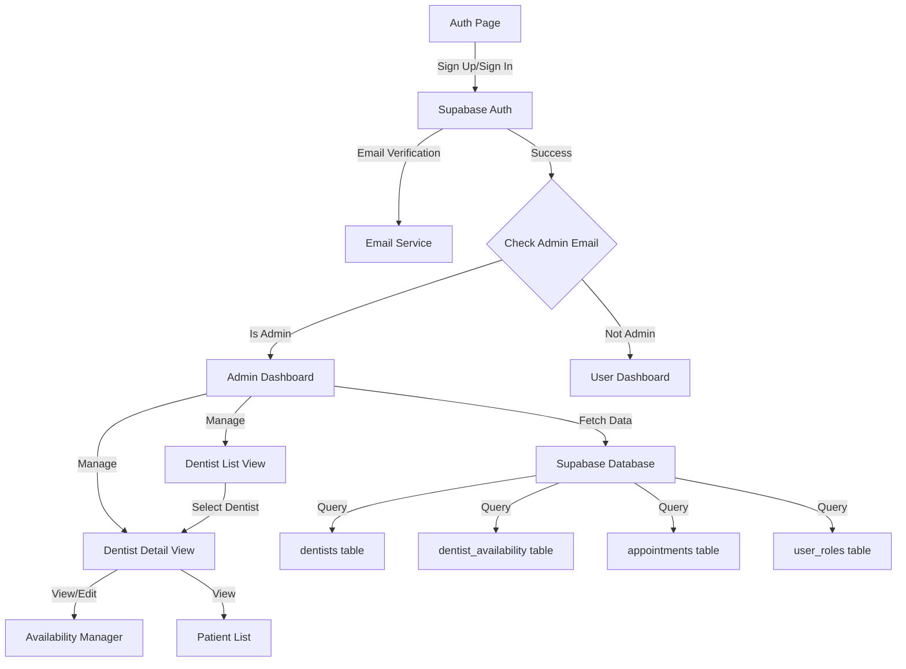
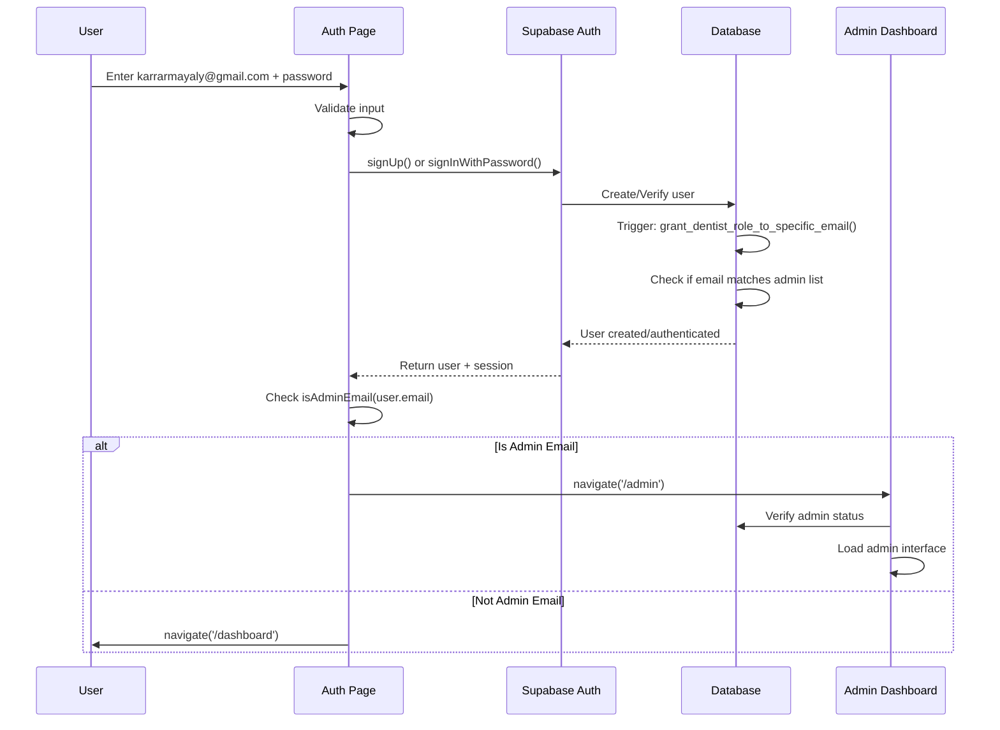

# Admin Dentist Management System - Design Document

## Overview

This design document outlines the implementation of an admin authentication and dentist management system. The system enables designated admin users (identified by email) to manage dentist accounts, view their patients, and control their availability schedules. The design addresses the current authentication issue where admin users cannot successfully sign up and access the admin dashboard.

### Key Problems Being Solved

1. **Authentication Flow Issue**: Admin users signing up with karrarmayaly@gmail.com are not being redirected properly after signup/signin
2. **Missing Admin Dashboard Functionality**: The current admin dashboard is a placeholder with no actual management features
3. **No Dentist Management Interface**: Admins cannot view or manage dentist accounts, their patients, or availability schedules

## Architecture

### System Components



### Authentication Flow



### Data Flow

1. **Authentication**: User credentials → Supabase Auth → Database triggers → Role assignment
2. **Admin Verification**: User email → isAdminEmail() check → Route decision
3. **Dentist List**: Admin Dashboard → Query dentists table → Display list
4. **Dentist Details**: Select dentist → Query dentist + availability + appointments → Display details
5. **Availability Management**: Admin edits → Update dentist_availability table → Refresh view
6. **Patient View**: Select dentist → Query appointments with patient info → Display list

## Components and Interfaces

### 1. Authentication Enhancement (src/pages/Auth.tsx)

**Current Issues:**
- Email verification flow may be blocking admin access
- Redirect logic needs to be more robust
- Error handling for admin-specific scenarios is missing

**Design Changes:**
- Add explicit logging for admin email detection
- Improve redirect logic after successful authentication
- Add admin-specific error messages
- Handle email verification state for admin users

**Key Functions:**
```typescript
// Enhanced admin check with logging
const checkAndRedirectAdmin = (user: User) => {
  const isAdmin = isAdminEmail(user.email);
  console.log('Admin check:', { email: user.email, isAdmin });
  
  if (isAdmin) {
    navigate('/admin', { replace: true });
  } else {
    navigate('/dashboard', { replace: true });
  }
};

// Handle post-verification redirect
useEffect(() => {
  const handleAuthStateChange = async () => {
    const { data: { session } } = await supabase.auth.getSession();
    if (session?.user) {
      checkAndRedirectAdmin(session.user);
    }
  };
  
  handleAuthStateChange();
}, []);
```

### 2. Admin Email Configuration (src/lib/auth.ts)

**Current Implementation:**
```typescript
export const ADMIN_EMAILS: string[] = ["karrarmayaly@gmail.com"];
export function isAdminEmail(email: string | null | undefined): boolean {
  if (!email) return false;
  return ADMIN_EMAILS.some(admin => admin.toLowerCase() === email.toLowerCase());
}
```

**Design Decision:** Keep this simple configuration-based approach. For production, this could be moved to environment variables or database, but for now, hardcoding is acceptable.

### 3. Admin Dashboard (src/pages/Admin.tsx)

**Current State:** Placeholder with no functionality

**New Design:**

```typescript
interface AdminDashboardProps {}

const Admin = () => {
  const { user, loading } = useAuth();
  const navigate = useNavigate();
  const [dentists, setDentists] = useState<Dentist[]>([]);
  const [selectedDentist, setSelectedDentist] = useState<Dentist | null>(null);
  const [isLoading, setIsLoading] = useState(true);

  // Access control
  useEffect(() => {
    if (loading) return;
    if (!isAdminEmail(user?.email)) {
      navigate("/", { replace: true });
    }
  }, [user, loading, navigate]);

  // Fetch dentists
  useEffect(() => {
    fetchDentists();
  }, []);

  return (
    <div className="min-h-screen">
      <Navbar />
      <section className="pt-28 pb-12 container mx-auto px-4">
        <h1 className="text-4xl font-bold mb-6">Admin Dashboard</h1>
        <div className="grid md:grid-cols-3 gap-6">
          <DentistList 
            dentists={dentists}
            onSelect={setSelectedDentist}
            selectedId={selectedDentist?.id}
          />
          {selectedDentist && (
            <DentistDetails 
              dentist={selectedDentist}
              onUpdate={fetchDentists}
            />
          )}
        </div>
      </section>
      <Footer />
    </div>
  );
};
```

### 4. Dentist List Component (src/components/admin/DentistList.tsx)

**Purpose:** Display all dentists with key information

**Interface:**
```typescript
interface DentistListProps {
  dentists: Dentist[];
  onSelect: (dentist: Dentist) => void;
  selectedId?: string;
}

interface Dentist {
  id: string;
  full_name: string;
  email: string;
  specialization: string;
  years_of_experience: number;
  rating: number;
  patient_count?: number;
}
```

**Features:**
- Searchable/filterable list
- Shows dentist name, specialization, rating
- Displays patient count
- Highlights selected dentist
- Loading and empty states

### 5. Dentist Details Component (src/components/admin/DentistDetails.tsx)

**Purpose:** Show detailed information and management options for selected dentist

**Interface:**
```typescript
interface DentistDetailsProps {
  dentist: Dentist;
  onUpdate: () => void;
}
```

**Sections:**
- Dentist profile information
- Availability schedule manager
- Patient list viewer
- Statistics (total appointments, upcoming, completed)

### 6. Availability Manager Component (src/components/admin/AvailabilityManager.tsx)

**Purpose:** View and edit dentist availability schedules

**Interface:**
```typescript
interface AvailabilityManagerProps {
  dentistId: string;
  onUpdate: () => void;
}

interface AvailabilitySlot {
  id: string;
  day_of_week: number; // 0-6 (Sunday-Saturday)
  start_time: string;  // HH:MM format
  end_time: string;    // HH:MM format
  is_available: boolean;
}
```

**Features:**
- Weekly calendar view
- Add new time slots
- Remove existing slots
- Toggle availability on/off
- Validation (no overlapping slots, end time after start time)

### 7. Patient List Component (src/components/admin/PatientList.tsx)

**Purpose:** Display patients (appointments) for a selected dentist

**Interface:**
```typescript
interface PatientListProps {
  dentistId: string;
}

interface PatientAppointment {
  id: string;
  patient_name: string;
  patient_email: string;
  appointment_date: string;
  appointment_time: string;
  status: 'pending' | 'confirmed' | 'completed' | 'cancelled';
  symptoms?: string;
}
```

**Features:**
- Filterable by status
- Sortable by date
- Shows appointment details
- Patient contact information
- Appointment count summary

## Data Models

### Database Schema (Existing)

```sql
-- user_roles table
CREATE TABLE public.user_roles (
  id UUID PRIMARY KEY,
  user_id UUID REFERENCES auth.users(id),
  role app_role NOT NULL, -- 'patient' | 'dentist' | 'admin'
  created_at TIMESTAMPTZ
);

-- dentists table
CREATE TABLE public.dentists (
  id UUID PRIMARY KEY REFERENCES public.profiles(id),
  specialization TEXT NOT NULL,
  bio TEXT,
  years_of_experience INTEGER,
  rating DECIMAL(3,2),
  created_at TIMESTAMPTZ,
  updated_at TIMESTAMPTZ
);

-- dentist_availability table
CREATE TABLE public.dentist_availability (
  id UUID PRIMARY KEY,
  dentist_id UUID REFERENCES public.dentists(id),
  day_of_week INTEGER CHECK (day_of_week BETWEEN 0 AND 6),
  start_time TIME NOT NULL,
  end_time TIME NOT NULL,
  is_available BOOLEAN DEFAULT true,
  created_at TIMESTAMPTZ,
  updated_at TIMESTAMPTZ
);

-- appointments table (relevant columns)
CREATE TABLE public.appointments (
  id UUID PRIMARY KEY,
  patient_id UUID REFERENCES auth.users(id),
  dentist_id UUID REFERENCES public.dentists(id),
  appointment_date DATE NOT NULL,
  appointment_time TIME NOT NULL,
  status TEXT,
  symptoms TEXT,
  created_at TIMESTAMPTZ
);
```

### TypeScript Interfaces

```typescript
// src/types/admin.ts
export interface Dentist {
  id: string;
  full_name: string;
  email: string;
  specialization: string;
  bio: string | null;
  years_of_experience: number | null;
  rating: number;
  created_at: string;
  updated_at: string;
}

export interface DentistAvailability {
  id: string;
  dentist_id: string;
  day_of_week: number;
  start_time: string;
  end_time: string;
  is_available: boolean;
  created_at: string;
  updated_at: string;
}

export interface DentistAppointment {
  id: string;
  patient_id: string;
  patient_name: string;
  patient_email: string;
  dentist_id: string;
  appointment_date: string;
  appointment_time: string;
  status: 'pending' | 'confirmed' | 'completed' | 'cancelled';
  symptoms: string | null;
  created_at: string;
}

export interface DentistStats {
  total_appointments: number;
  upcoming_appointments: number;
  completed_appointments: number;
  total_patients: number;
  average_rating: number;
}
```

## Database Queries

### 1. Fetch All Dentists with Patient Count

```typescript
const fetchDentists = async () => {
  const { data, error } = await supabase
    .from('dentists')
    .select(`
      *,
      profiles!inner(full_name, email),
      appointments(count)
    `)
    .order('created_at', { ascending: false });
  
  return data;
};
```

### 2. Fetch Dentist Availability

```typescript
const fetchAvailability = async (dentistId: string) => {
  const { data, error } = await supabase
    .from('dentist_availability')
    .select('*')
    .eq('dentist_id', dentistId)
    .order('day_of_week', { ascending: true })
    .order('start_time', { ascending: true });
  
  return data;
};
```

### 3. Fetch Dentist Appointments with Patient Info

```typescript
const fetchDentistAppointments = async (dentistId: string) => {
  const { data, error } = await supabase
    .from('appointments')
    .select(`
      *,
      profiles!appointments_patient_id_fkey(full_name, email)
    `)
    .eq('dentist_id', dentistId)
    .order('appointment_date', { ascending: false })
    .order('appointment_time', { ascending: false });
  
  return data;
};
```

### 4. Update Availability Slot

```typescript
const updateAvailability = async (
  slotId: string,
  updates: Partial<DentistAvailability>
) => {
  const { data, error } = await supabase
    .from('dentist_availability')
    .update(updates)
    .eq('id', slotId)
    .select()
    .single();
  
  return data;
};
```

### 5. Add New Availability Slot

```typescript
const addAvailability = async (slot: Omit<DentistAvailability, 'id' | 'created_at' | 'updated_at'>) => {
  const { data, error } = await supabase
    .from('dentist_availability')
    .insert(slot)
    .select()
    .single();
  
  return data;
};
```

### 6. Delete Availability Slot

```typescript
const deleteAvailability = async (slotId: string) => {
  const { error } = await supabase
    .from('dentist_availability')
    .delete()
    .eq('id', slotId);
  
  return !error;
};
```

## Error Handling

### Authentication Errors

1. **Email Already Exists**
   - Detection: Supabase returns user with empty identities array
   - Action: Show toast, switch to sign-in mode
   - Message: "This email is already registered. Please sign in instead."

2. **Email Not Verified**
   - Detection: Sign-in error contains "Email not confirmed"
   - Action: Show verification banner, provide resend option
   - Message: "Please verify your email before signing in. Check your inbox."

3. **Invalid Credentials**
   - Detection: Sign-in error contains "Invalid login credentials"
   - Action: Show error toast
   - Message: "Invalid email or password. Please try again."

4. **Network Errors**
   - Detection: Catch network-related errors
   - Action: Show retry option
   - Message: "Connection error. Please check your internet and try again."

### Admin Dashboard Errors

1. **Unauthorized Access**
   - Detection: User email not in ADMIN_EMAILS
   - Action: Redirect to home page
   - Message: None (silent redirect)

2. **Data Fetch Failures**
   - Detection: Supabase query returns error
   - Action: Show error state with retry button
   - Message: "Failed to load data. Please try again."

3. **Update Failures**
   - Detection: Update/insert/delete returns error
   - Action: Show error toast, don't update UI
   - Message: "Failed to save changes. Please try again."

### Validation Errors

1. **Overlapping Time Slots**
   - Detection: Check existing slots before insert
   - Action: Show validation error
   - Message: "This time slot overlaps with an existing slot."

2. **Invalid Time Range**
   - Detection: end_time <= start_time
   - Action: Show validation error
   - Message: "End time must be after start time."

3. **Invalid Day of Week**
   - Detection: day_of_week not in 0-6 range
   - Action: Show validation error
   - Message: "Invalid day selected."

## Testing Strategy

### Unit Tests

1. **isAdminEmail() Function**
   - Test with admin email (should return true)
   - Test with non-admin email (should return false)
   - Test with null/undefined (should return false)
   - Test case insensitivity

2. **Validation Functions**
   - Test time slot overlap detection
   - Test time range validation
   - Test day of week validation

### Integration Tests

1. **Authentication Flow**
   - Test admin signup with karrarmayaly@gmail.com
   - Test admin signin
   - Test redirect to /admin
   - Test non-admin redirect to /dashboard
   - Test email verification flow

2. **Admin Dashboard**
   - Test dentist list loading
   - Test dentist selection
   - Test availability fetching
   - Test patient list fetching

3. **Availability Management**
   - Test adding new slot
   - Test updating existing slot
   - Test deleting slot
   - Test validation errors

### Manual Testing Checklist

1. **Admin Authentication**
   - [ ] Sign up with karrarmayaly@gmail.com
   - [ ] Verify email (if required)
   - [ ] Sign in with admin email
   - [ ] Verify redirect to /admin
   - [ ] Try accessing /admin as non-admin (should redirect)

2. **Dentist Management**
   - [ ] View list of all dentists
   - [ ] Select a dentist
   - [ ] View dentist details
   - [ ] View dentist availability
   - [ ] View dentist patients

3. **Availability Management**
   - [ ] Add new availability slot
   - [ ] Edit existing slot
   - [ ] Delete slot
   - [ ] Test validation (overlapping slots, invalid times)

4. **Error Scenarios**
   - [ ] Test with no internet connection
   - [ ] Test with invalid data
   - [ ] Test with empty states (no dentists, no appointments)

## Security Considerations

### Access Control

1. **Client-Side Protection**
   - Check isAdminEmail() before rendering admin components
   - Redirect non-admin users immediately
   - Hide admin navigation for non-admin users

2. **Server-Side Protection (RLS)**
   - Current RLS policies allow authenticated users to view dentists
   - Availability management requires dentist role
   - **Gap**: Need admin-specific RLS policies for managing other dentists' availability

### Recommended RLS Updates

```sql
-- Allow admins to manage any dentist's availability
CREATE POLICY "Admins can manage all availability"
  ON public.dentist_availability FOR ALL
  USING (
    EXISTS (
      SELECT 1 FROM auth.users
      WHERE auth.users.id = auth.uid()
      AND auth.users.email = 'karrarmayaly@gmail.com'
    )
  );

-- Allow admins to view all appointments
CREATE POLICY "Admins can view all appointments"
  ON public.appointments FOR SELECT
  USING (
    EXISTS (
      SELECT 1 FROM auth.users
      WHERE auth.users.id = auth.uid()
      AND auth.users.email = 'karrarmayaly@gmail.com'
    )
  );
```

### Data Validation

1. **Input Sanitization**
   - Validate all time inputs (HH:MM format)
   - Validate day_of_week range (0-6)
   - Sanitize text inputs to prevent XSS

2. **Business Logic Validation**
   - Prevent overlapping time slots
   - Ensure end time is after start time
   - Validate date ranges

## Performance Considerations

### Optimization Strategies

1. **Data Fetching**
   - Use Supabase select with joins to minimize queries
   - Implement pagination for large dentist lists
   - Cache dentist list data
   - Use React Query for automatic caching and refetching

2. **UI Rendering**
   - Virtualize long lists (dentists, appointments)
   - Lazy load dentist details
   - Debounce search/filter inputs
   - Use React.memo for expensive components

3. **Database Queries**
   - Add indexes on frequently queried columns (dentist_id, patient_id)
   - Use count aggregations efficiently
   - Limit result sets with pagination

### Monitoring

1. **Performance Metrics**
   - Track page load times
   - Monitor query execution times
   - Log slow queries (>1s)

2. **Error Tracking**
   - Log authentication failures
   - Track API errors
   - Monitor RLS policy violations

## Implementation Notes

### Phase 1: Fix Authentication (Priority: Critical)

1. Update Auth.tsx to handle admin redirects properly
2. Add comprehensive logging for debugging
3. Test email verification flow
4. Ensure database trigger is working

### Phase 2: Build Admin Dashboard (Priority: High)

1. Create basic admin dashboard layout
2. Implement dentist list component
3. Add dentist selection functionality
4. Create dentist details view

### Phase 3: Availability Management (Priority: High)

1. Build availability manager component
2. Implement CRUD operations for availability
3. Add validation logic
4. Create RLS policies for admin access

### Phase 4: Patient View (Priority: Medium)

1. Create patient list component
2. Fetch and display appointments
3. Add filtering and sorting
4. Display statistics

### Phase 5: Polish and Testing (Priority: Medium)

1. Add loading states
2. Improve error handling
3. Add empty states
4. Conduct thorough testing
5. Fix any bugs

## Future Enhancements

1. **Admin Role in Database**
   - Move from email-based to role-based admin detection
   - Add 'admin' role to user_roles table
   - Update RLS policies to use role instead of email

2. **Bulk Operations**
   - Bulk update availability for multiple dentists
   - Export dentist/appointment data
   - Batch notifications

3. **Analytics Dashboard**
   - Appointment trends
   - Dentist performance metrics
   - Patient satisfaction scores

4. **Advanced Filtering**
   - Filter dentists by specialization, rating, availability
   - Search appointments by patient name, date range
   - Custom report generation

5. **Notifications**
   - Email notifications for appointment changes
   - Admin alerts for system events
   - Dentist notifications for schedule changes
