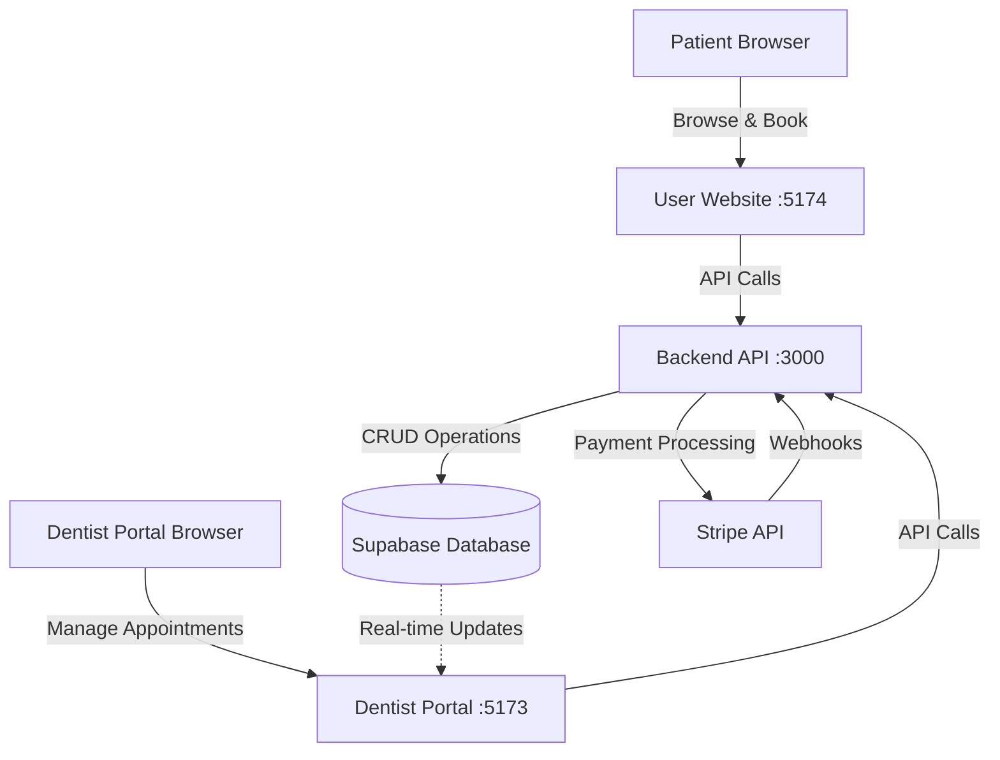

# Design Document

## Overview

The Appointment Booking and Payment System is a full-stack feature that enables patients to book dental appointments through the user website and allows dentists to manage those appointments through their dedicated portal. The system integrates Stripe for secure online payments while also supporting cash payments. The architecture follows a three-tier model with React frontends (User Website and Dentist Portal), an Express.js backend API, and Supabase as the database layer.

### Key Design Principles

1. **Separation of Concerns**: Clear boundaries between presentation (React), business logic (Express services), and data access (Supabase repositories)
2. **Real-time Synchronization**: Leverage existing Supabase real-time capabilities to ensure dentist portals update immediately when new appointments are created
3. **Payment Flexibility**: Support both online (Stripe) and offline (cash) payment methods with appropriate status tracking
4. **User Experience**: Minimize friction in the booking process with clear validation, loading states, and confirmation messages
5. **Security**: Implement proper authentication, authorization, and secure payment handling
6. **Extensibility**: Design the system to easily accommodate future features like appointment reminders, cancellations, and rescheduling

## Architecture

### System Context



### Component Architecture

The system consists of four main components:

1. **User Website (Patient-Facing)**: React application where patients browse dentists and book appointments
2. **Dentist Portal**: React application where dentists manage their appointments and schedules
3. **Backend API**: Express.js server handling business logic, data validation, and external integrations
4. **Database Layer**: Supabase PostgreSQL database with real-time capabilities

### Technology Stack

**Frontend (User Website & Dentist Portal)**
- React 18 with TypeScript
- Vite for build tooling
- TailwindCSS for styling
- React Hook Form for form management
- Zod for validation
- Axios for HTTP requests
- React Query for data fetching and caching
- Stripe.js for payment integration

**Backend**
- Node.js with Express.js
- TypeScript for type safety
- Supabase client for database operations
- Stripe SDK for payment processing
- Winston for logging
- Zod for request validation
- CORS for cross-origin requests

**Database**
- Supabase (PostgreSQL)
- Real-time subscriptions for live updates

**External Services**
- Stripe for payment processing

## Components and Interfaces

### 1. Frontend Components (User Website)

#### 1.1 BookingForm Component

**Purpose**: Main form component for booking appointments

**Props**:
```typescript
interface BookingFormProps {
  dentistId: string;
  dentistName: string;
  dentistEmail: string;
  onSuccess?: (appointmentId: string) => void;
}
```

**State Management**:
```typescript
interface BookingFormState {
  patientName: string;
  patientEmail: string;
  phone: string;
  reason: string;
  date: Date | null;
  time: string;
  paymentMethod: 'stripe' | 'cash';
  isSubmitting: boolean;
  error: string | null;
}
```

**Key Features**:
- Form validation using React Hook Form + Zod
- Date picker with past date restrictions
- Time slot selection
- Payment method radio buttons
- Loading states during submission
- Error message display

#### 1.2 BookingConfirmation Component

**Purpose**: Display confirmation after successful booking

**Props**:
```typescript
interface BookingConfirmationProps {
  appointmentId: string;
  dentistName: string;
  date: string;
  time: string;
  paymentMethod: 'stripe' | 'cash';
  paymentStatus: 'pending' | 'paid';
}
```

#### 1.3 MyAppointments Component

**Purpose**: Display patient's appointment history

**Features**:
- List of all appointments
- Filter by status (upcoming, completed, cancelled)
- Display appointment details
- Show payment status

### 2. Frontend Components (Dentist Portal)

#### 2.1 AppointmentsTab Component

**Purpose**: Main appointments management interface for dentists

**Features**:
- Table/list view of all appointments
- Real-time updates via Supabase subscriptions
- Sort by date/time
- Filter by status
- Action buttons (mark complete, reschedule)

**State Management**:
```typescript
interface AppointmentsState {
  appointments: Appointment[];
  isLoading: boolean;
  error: string | null;
  filter: AppointmentStatus | 'all';
  sortBy: 'date' | 'status';
}
```

#### 2.2 AppointmentCard Component

**Purpose**: Display individual appointment details

**Props**:
```typescript
interface AppointmentCardProps {
  appointment: Appointment;
  onMarkComplete: (id: string) => void;
  onReschedule: (id: string, newDate: Date, newTime: string) => void;
}
```

#### 2.3 RescheduleDialog Component

**Purpose**: Modal for rescheduling appointments

**Props**:
```typescript
interface RescheduleDialogProps {
  appointment: Appointment;
  isOpen: boolean;
  onClose: () => void;
  onConfirm: (newDate: Date, newTime: string) => void;
}
```

### 3. Backend API Endpoints

#### 3.1 Appointments Endpoints

**POST /api/appointments**
- **Purpose**: Create a new appointment
- **Authentication**: Required (patient)
- **Request Body**:
```typescript
{
  patientName: string;
  patientEmail: string;
  phone: string;
  dentistEmail: string;
  reason: string;
  date: string; // ISO 8601 format
  time: string; // HH:mm format
  paymentMethod: 'stripe' | 'cash';
  notes?: string;
}
```
- **Response**: 
```typescript
{
  success: true;
  data: {
    appointmentId: string;
    status: 'pending' | 'confirmed';
    paymentStatus: 'pending' | 'paid';
  }
}
```
- **Error Codes**: 400 (validation), 409 (slot unavailable), 500 (server error)

**GET /api/appointments/dentist/:dentistEmail**
- **Purpose**: Retrieve all appointments for a dentist
- **Authentication**: Required (dentist)
- **Query Parameters**:
  - `status`: Filter by appointment status
  - `from`: Start date filter
  - `to`: End date filter
  - `limit`: Pagination limit
  - `offset`: Pagination offset
- **Response**:
```typescript
{
  success: true;
  data: Appointment[];
  pagination: {
    total: number;
    limit: number;
    offset: number;
    hasMore: boolean;
  }
}
```

**GET /api/appointments/patient/:email**
- **Purpose**: Retrieve all appointments for a patient
- **Authentication**: Required (patient)
- **Response**: Same as dentist endpoint

**PUT /api/appointments/:id**
- **Purpose**: Update appointment details
- **Authentication**: Required (dentist or patient)
- **Request Body**:
```typescript
{
  date?: string;
  time?: string;
  status?: 'pending' | 'confirmed' | 'completed' | 'cancelled';
  notes?: string;
}
```
- **Response**:
```typescript
{
  success: true;
  data: Appointment;
}
```

**DELETE /api/appointments/:id**
- **Purpose**: Cancel an appointment
- **Authentication**: Required (patient or dentist)
- **Response**:
```typescript
{
  success: true;
  message: string;
}
```

#### 3.2 Payment Endpoints

**POST /api/payments/create-checkout-session**
- **Purpose**: Create a Stripe Checkout session for appointment payment
- **Authentication**: Required (patient)
- **Request Body**:
```typescript
{
  appointmentId: string;
  amount: number; // in cents
  currency: string; // e.g., 'usd'
  dentistName: string;
  patientEmail: string;
}
```
- **Response**:
```typescript
{
  success: true;
  data: {
    sessionId: string;
    url: string; // Stripe Checkout URL
  }
}
```

**POST /api/payments/webhook**
- **Purpose**: Handle Stripe webhook events
- **Authentication**: Stripe signature verification
- **Handles Events**:
  - `checkout.session.completed`: Update appointment payment status to 'paid'
  - `checkout.session.expired`: Update appointment payment status to 'failed'
  - `payment_intent.payment_failed`: Update appointment payment status to 'failed'

### 4. Backend Services

#### 4.1 AppointmentsService

**Purpose**: Business logic for appointment management

**Methods**:

```typescript
class AppointmentsService {
  async createAppointment(data: CreateAppointmentDTO): Promise<Appointment>
  async getAppointmentById(id: string): Promise<Appointment | null>
  async getAppointmentsByDentist(dentistEmail: string, filters: AppointmentFilters): Promise<PaginatedResponse<Appointment>>
  async getAppointmentsByPatient(patientEmail: string, filters: AppointmentFilters): Promise<PaginatedResponse<Appointment>>
  async updateAppointment(id: string, data: UpdateAppointmentDTO): Promise<Appointment>
  async cancelAppointment(id: string, userId: string): Promise<void>
  async markAppointmentComplete(id: string, dentistId: string): Promise<Appointment>
  async rescheduleAppointment(id: string, newDate: Date, newTime: string): Promise<Appointment>
  async checkSlotAvailability(dentistEmail: string, date: Date, time: string): Promise<boolean>
}
```

**Business Rules**:
- Validate appointment date is not in the past
- Check slot availability before creating appointment
- Prevent double-booking
- Validate user permissions for updates
- Handle concurrent booking attempts

#### 4.2 PaymentService

**Purpose**: Handle Stripe payment integration

**Methods**:

```typescript
class PaymentService {
  async createCheckoutSession(params: CheckoutSessionParams): Promise<{ sessionId: string; url: string }>
  async handleWebhookEvent(event: Stripe.Event): Promise<void>
  async updatePaymentStatus(appointmentId: string, status: 'paid' | 'failed'): Promise<void>
  async getPaymentDetails(appointmentId: string): Promise<PaymentDetails | null>
}
```

**Stripe Integration Details**:
- Use Stripe Checkout for hosted payment page
- Store appointment ID in session metadata
- Handle webhook events for payment status updates
- Implement idempotency for webhook processing
- Log all payment events for audit trail

### 5. Database Schema

#### 5.1 Appointments Table

```sql
CREATE TABLE appointments (
  id UUID PRIMARY KEY DEFAULT uuid_generate_v4(),
  patient_id UUID REFERENCES auth.users(id),
  patient_name VARCHAR(255) NOT NULL,
  patient_email VARCHAR(255) NOT NULL,
  patient_phone VARCHAR(50) NOT NULL,
  dentist_id UUID REFERENCES dentists(id),
  dentist_email VARCHAR(255) NOT NULL,
  reason TEXT NOT NULL,
  appointment_date DATE NOT NULL,
  appointment_time TIME NOT NULL,
  payment_method VARCHAR(20) NOT NULL CHECK (payment_method IN ('stripe', 'cash')),
  payment_status VARCHAR(20) NOT NULL DEFAULT 'pending' CHECK (payment_status IN ('pending', 'paid', 'failed')),
  status VARCHAR(20) NOT NULL DEFAULT 'pending' CHECK (status IN ('pending', 'confirmed', 'completed', 'cancelled')),
  notes TEXT,
  stripe_session_id VARCHAR(255),
  stripe_payment_intent_id VARCHAR(255),
  created_at TIMESTAMP WITH TIME ZONE DEFAULT NOW(),
  updated_at TIMESTAMP WITH TIME ZONE DEFAULT NOW(),
  
  CONSTRAINT unique_dentist_datetime UNIQUE (dentist_email, appointment_date, appointment_time)
);

CREATE INDEX idx_appointments_dentist ON appointments(dentist_email, appointment_date);
CREATE INDEX idx_appointments_patient ON appointments(patient_email, appointment_date);
CREATE INDEX idx_appointments_status ON appointments(status);
CREATE INDEX idx_appointments_payment_status ON appointments(payment_status);
```

#### 5.2 Payment Transactions Table

```sql
CREATE TABLE payment_transactions (
  id UUID PRIMARY KEY DEFAULT uuid_generate_v4(),
  appointment_id UUID REFERENCES appointments(id) ON DELETE CASCADE,
  stripe_session_id VARCHAR(255),
  stripe_payment_intent_id VARCHAR(255),
  amount INTEGER NOT NULL, -- in cents
  currency VARCHAR(3) NOT NULL DEFAULT 'usd',
  status VARCHAR(20) NOT NULL CHECK (status IN ('pending', 'processing', 'succeeded', 'failed', 'cancelled')),
  payment_method VARCHAR(20) NOT NULL,
  error_message TEXT,
  metadata JSONB,
  created_at TIMESTAMP WITH TIME ZONE DEFAULT NOW(),
  updated_at TIMESTAMP WITH TIME ZONE DEFAULT NOW()
);

CREATE INDEX idx_payment_transactions_appointment ON payment_transactions(appointment_id);
CREATE INDEX idx_payment_transactions_stripe_session ON payment_transactions(stripe_session_id);
```

### 6. Data Models

#### 6.1 Appointment Model

```typescript
interface Appointment {
  id: string;
  patientId: string | null;
  patientName: string;
  patientEmail: string;
  patientPhone: string;
  dentistId: string;
  dentistEmail: string;
  reason: string;
  appointmentDate: string; // YYYY-MM-DD
  appointmentTime: string; // HH:mm
  paymentMethod: 'stripe' | 'cash';
  paymentStatus: 'pending' | 'paid' | 'failed';
  status: 'pending' | 'confirmed' | 'completed' | 'cancelled';
  notes: string | null;
  stripeSessionId: string | null;
  stripePaymentIntentId: string | null;
  createdAt: string;
  updatedAt: string;
}
```

#### 6.2 Payment Transaction Model

```typescript
interface PaymentTransaction {
  id: string;
  appointmentId: string;
  stripeSessionId: string | null;
  stripePaymentIntentId: string | null;
  amount: number; // in cents
  currency: string;
  status: 'pending' | 'processing' | 'succeeded' | 'failed' | 'cancelled';
  paymentMethod: string;
  errorMessage: string | null;
  metadata: Record<string, any>;
  createdAt: string;
  updatedAt: string;
}
```

## Error Handling

### Frontend Error Handling

**Validation Errors**:
- Display inline error messages below form fields
- Highlight invalid fields with red borders
- Prevent form submission until all errors are resolved

**API Errors**:
- Display user-friendly error messages in toast notifications
- Log detailed errors to console for debugging
- Provide retry mechanisms for transient failures

**Payment Errors**:
- Display Stripe error messages clearly
- Provide option to try different payment method
- Log payment failures for support investigation

### Backend Error Handling

**Error Response Format**:
```typescript
{
  success: false;
  error: {
    code: string;
    message: string;
    details?: Record<string, any>;
    timestamp: string;
  }
}
```

**Error Types**:
- `VALIDATION_ERROR`: Invalid request data (400)
- `UNAUTHORIZED`: Missing or invalid authentication (401)
- `FORBIDDEN`: Insufficient permissions (403)
- `NOT_FOUND`: Resource not found (404)
- `CONFLICT`: Slot already booked (409)
- `PAYMENT_ERROR`: Stripe payment failure (402)
- `INTERNAL_ERROR`: Server error (500)

**Error Logging**:
- Use Winston logger for structured logging
- Log all errors with context (user ID, request ID, timestamp)
- Include stack traces for debugging
- Send critical errors to monitoring service

## Testing Strategy

### Unit Tests

**Frontend**:
- Test form validation logic
- Test component rendering with different props
- Test state management and hooks
- Mock API calls and test response handling

**Backend**:
- Test service methods with various inputs
- Test validation schemas
- Test error handling paths
- Mock database and Stripe calls

### Integration Tests

**API Tests**:
- Test complete request/response cycles
- Test authentication and authorization
- Test database operations
- Test Stripe webhook handling

**End-to-End Tests**:
- Test complete booking flow (form submission → payment → confirmation)
- Test dentist appointment management flow
- Test real-time updates in dentist portal
- Test error scenarios (invalid data, payment failures)

### Test Data

**Mock Appointments**:
```typescript
const mockAppointment = {
  patientName: 'John Doe',
  patientEmail: 'john@example.com',
  patientPhone: '+1234567890',
  dentistEmail: 'dr.smith@dental.com',
  reason: 'Regular checkup',
  appointmentDate: '2025-11-01',
  appointmentTime: '10:00',
  paymentMethod: 'stripe',
};
```

**Mock Stripe Events**:
- Successful payment
- Failed payment
- Expired session

### Testing Tools

- **Frontend**: Vitest, React Testing Library
- **Backend**: Vitest, Supertest
- **E2E**: Playwright or Cypress
- **API Testing**: Postman/Insomnia collections

## Security Considerations

### Authentication & Authorization

- Use Supabase Auth for user authentication
- Implement JWT token validation in backend middleware
- Verify user roles (patient, dentist) before allowing operations
- Patients can only view/modify their own appointments
- Dentists can only view/modify appointments for their practice

### Data Protection

- Encrypt sensitive data at rest (Supabase handles this)
- Use HTTPS for all communications
- Sanitize user inputs to prevent SQL injection
- Validate and sanitize all request data
- Implement rate limiting to prevent abuse

### Payment Security

- Never store credit card details (Stripe handles this)
- Use Stripe Checkout for PCI compliance
- Verify webhook signatures to prevent spoofing
- Implement idempotency keys for payment operations
- Log all payment events for audit trail

### CORS Configuration

```typescript
const corsOptions = {
  origin: [
    'http://localhost:5174', // User website
    'http://localhost:5173', // Dentist portal
    'https://yourdomain.com', // Production user website
    'https://dentist.yourdomain.com', // Production dentist portal
  ],
  credentials: true,
  methods: ['GET', 'POST', 'PUT', 'DELETE'],
  allowedHeaders: ['Content-Type', 'Authorization'],
};
```

## Performance Optimization

### Frontend Optimization

- Implement React Query for data caching and automatic refetching
- Use debouncing for search/filter inputs
- Lazy load appointment lists with pagination
- Optimize re-renders with React.memo and useMemo
- Code splitting for booking and appointments pages

### Backend Optimization

- Implement database connection pooling
- Add indexes on frequently queried columns
- Use database transactions for atomic operations
- Implement caching for dentist availability data
- Rate limit API endpoints to prevent abuse

### Real-time Updates

- Use Supabase real-time subscriptions efficiently
- Subscribe only to relevant appointment changes
- Implement reconnection logic for dropped connections
- Batch updates to reduce re-renders

## Deployment Considerations

### Environment Variables

**Backend**:
```env
PORT=3000
NODE_ENV=production
SUPABASE_URL=https://your-project.supabase.co
SUPABASE_ANON_KEY=your-anon-key
SUPABASE_SERVICE_KEY=your-service-key
STRIPE_SECRET_KEY=sk_live_...
STRIPE_WEBHOOK_SECRET=whsec_...
FRONTEND_URL=https://yourdomain.com
DENTIST_PORTAL_URL=https://dentist.yourdomain.com
```

**Frontend (User Website)**:
```env
VITE_API_URL=https://api.yourdomain.com
VITE_STRIPE_PUBLISHABLE_KEY=pk_live_...
VITE_SUPABASE_URL=https://your-project.supabase.co
VITE_SUPABASE_ANON_KEY=your-anon-key
```

**Frontend (Dentist Portal)**:
```env
VITE_API_URL=https://api.yourdomain.com
VITE_SUPABASE_URL=https://your-project.supabase.co
VITE_SUPABASE_ANON_KEY=your-anon-key
```

### Database Migrations

- Use Supabase migrations for schema changes
- Version control all migration files
- Test migrations in staging before production
- Implement rollback procedures

### Monitoring & Logging

- Set up error tracking (e.g., Sentry)
- Monitor API response times
- Track payment success/failure rates
- Set up alerts for critical errors
- Monitor database performance

## Future Enhancements

1. **Email Notifications**: Send confirmation and reminder emails
2. **SMS Notifications**: Send appointment reminders via SMS
3. **Calendar Integration**: Allow patients to add appointments to Google Calendar/iCal
4. **Recurring Appointments**: Support for scheduling recurring appointments
5. **Waitlist**: Allow patients to join waitlist for fully booked slots
6. **Video Consultations**: Integrate video calling for remote consultations
7. **Patient Reviews**: Allow patients to review dentists after appointments
8. **Insurance Integration**: Support for insurance verification and claims
9. **Multi-language Support**: Internationalization for global reach
10. **Mobile Apps**: Native iOS and Android applications
