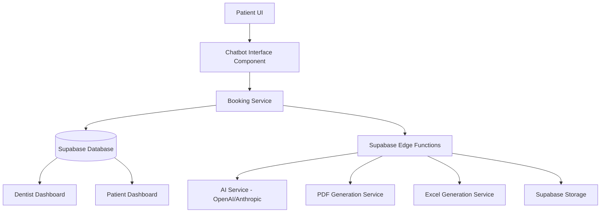

# Design Document: Chatbot Booking System

## Overview

The Chatbot Booking System is an intelligent, conversational interface that guides patients through the appointment booking process. The system integrates with the existing React/TypeScript frontend, Supabase backend, and leverages AI capabilities through Supabase Edge Functions to create a seamless booking experience. The chatbot collects patient information, manages appointment scheduling, generates structured summaries for dentists, and enforces cancellation policies.

### Key Design Principles

1. **Conversational Flow**: Natural, step-by-step guidance through the booking process
2. **Real-time Availability**: Dynamic display of dentist availability
3. **Document Generation**: Automated creation of PDF summaries and structured data sheets
4. **Role-based Access**: Separate views and capabilities for patients and dentists
5. **Data Security**: Encrypted storage of sensitive medical information

## Architecture

### High-Level Architecture



### Component Architecture

The system consists of three main layers:

1. **Presentation Layer**: React components for chatbot UI, patient dashboard, and dentist dashboard
2. **Business Logic Layer**: TypeScript services for booking management, validation, and state management
3. **Data Layer**: Supabase database, storage, and edge functions

## Components and Interfaces

### 1. Chatbot Interface Component

**Location**: `src/components/ChatbotBooking/ChatbotInterface.tsx`

**Purpose**: Provides the conversational UI for the booking process

**Key Features**:
- Message display with patient and bot messages
- Input field for patient responses
- File upload widget for medical documents
- Time slot selector
- Booking confirmation dialog

**Props Interface**:
```typescript
interface ChatbotInterfaceProps {
  dentistId: string;
  dentistName: string;
  onBookingComplete: (bookingId: string) => void;
  onCancel: () => void;
}
```

**State Management**:
- Conversation history (messages array)
- Current step in booking flow
- Collected patient data
- Selected time slot
- Uploaded documents

### 2. Booking Service

**Location**: `src/services/bookingService.ts`

**Purpose**: Manages booking logic, API calls, and data validation

**Key Methods**:
```typescript
interface BookingService {
  // Initialize chatbot conversation
  startBookingConversation(dentistId: string): Promise<ConversationSession>;
  
  // Send patient message and get bot response
  sendMessage(sessionId: string, message: string): Promise<BotResponse>;
  
  // Upload medical documents
  uploadDocument(file: File, appointmentId: string): Promise<DocumentUpload>;
  
  // Get available time slots
  getAvailableSlots(dentistId: string, date: Date): Promise<TimeSlot[]>;
  
  // Reserve time slot temporarily
  reserveTimeSlot(slotId: string): Promise<Reservation>;
  
  // Confirm booking
  confirmBooking(bookingData: BookingData): Promise<Appointment>;
  
  // Cancel appointment
  cancelAppointment(appointmentId: string): Promise<CancellationResult>;
  
  // Generate booking summary
  generateBookingSummary(appointmentId: string): Promise<SummaryDocument>;
  
  // Add uncertainty note to appointment
  addUncertaintyNote(appointmentId: string, note: string): Promise<void>;
}
```

### 3. Chatbot Conversation Manager

**Location**: `supabase/functions/chat-bot/index.ts`

**Purpose**: AI-powered conversation management using OpenAI or Anthropic

**Conversation Flow**:
1. Greeting and context setting
2. Collect patient phone number
3. Collect symptoms/reason for visit
   - If symptom is vague, suggest possible causes
   - Detect uncertainty responses ("I don't know", "not sure", etc.)
   - If uncertain, record note and proceed without re-asking
4. Request medical documents (optional)
5. Display available time slots
6. Confirm booking details
7. Process confirmation

**Uncertainty Detection Logic**:
```typescript
const uncertaintyIndicators = [
  'i don\'t know',
  'not sure',
  'no idea',
  'unsure',
  'don\'t know',
  'idk',
  'dunno',
  'maybe',
  'could be',
  'not certain'
];

const detectUncertainty = (message: string): boolean => {
  const lowerMessage = message.toLowerCase();
  return uncertaintyIndicators.some(indicator => 
    lowerMessage.includes(indicator)
  );
};

const handleUncertainResponse = (symptom: string): string => {
  return `Patient reports ${symptom} but is unsure of the cause.`;
};
```

**AI Prompt Structure**:
```typescript
const systemPrompt = `
You are a helpful dental appointment booking assistant. Guide the patient through:
1. Collecting their phone number for contact purposes
2. Understanding their dental concern
3. Collecting relevant medical history
4. Offering document upload
5. Showing available appointment times
6. Confirming booking details

Be empathetic, professional, and concise. Ask one question at a time.

IMPORTANT - Handling Uncertain Patients:
- When a patient describes a symptom (e.g., "my tooth hurts"), suggest 2-3 possible causes
- If the patient responds with uncertainty ("I don't know", "not sure", or similar), DO NOT ask again
- Instead, record the symptom with a note: "Patient reports [symptom] but is unsure of the cause"
- Respond empathetically: "It's okay not to know, the dentist can help find the cause. Would you like to book an appointment?"
- Proceed to the next step (document upload or time selection) without looping back
- Mark the cause field as "unspecified" or "unknown cause" in the booking data
`;
```

### 4. Document Generation Service

**Location**: `supabase/functions/generate-booking-summary/index.ts`

**Purpose**: Generate PDF summaries and Excel sheets for dentists

**PDF Summary Structure**:
- Patient Information (name, phone number, age, gender, email)
- Appointment Details (date, time, dentist)
- Chief Complaint (symptoms/reason for visit)
- Medical History (if provided)
- Uploaded Documents (links/thumbnails)
- Booking Reference Number

**Excel Sheet Structure**:
| Patient Name | Phone Number | Age | Gender | Symptoms | Appointment Time | Documents | Status |
|--------------|--------------|-----|--------|----------|------------------|-----------|--------|

**Technology**: 
- PDF: `jsPDF` or `pdfkit` library
- Excel: `exceljs` library

### 5. Patient Dashboard Enhancement

**Location**: `src/pages/Dashboard.tsx`

**New Features**:
- Upcoming appointments list with cancellation buttons
- Cancellation policy indicator (1-hour rule)
- Booking history
- Document upload status

**Cancellation Logic**:
```typescript
const canCancelAppointment = (appointmentTime: Date): boolean => {
  const now = new Date();
  const hoursDifference = (appointmentTime.getTime() - now.getTime()) / (1000 * 60 * 60);
  return hoursDifference > 1;
};
```

### 6. Dentist Dashboard Enhancement

**Location**: `src/pages/DentistDashboard.tsx`

**New Features**:
- Appointment sheet view (tabular format)
- Booking summary access
- Document viewer
- Private notes section
- Real-time updates for new bookings

**Appointment Sheet Component**:
```typescript
interface AppointmentSheetProps {
  appointments: Appointment[];
  onViewDetails: (appointmentId: string) => void;
  onAddNote: (appointmentId: string, note: string) => void;
}
```

## Data Models

### Database Schema Extensions

#### 1. Appointments Table (Enhanced)

```sql
ALTER TABLE public.appointments ADD COLUMN IF NOT EXISTS:
  - dentist_id UUID REFERENCES auth.users(id) -- Replace dentist_name
  - symptoms TEXT
  - chief_complaint TEXT
  - cause_identified BOOLEAN DEFAULT true -- false when patient is uncertain
  - uncertainty_note TEXT -- stores note when patient doesn't know cause
  - medical_history TEXT
  - documents JSONB DEFAULT '[]'
  - booking_summary_url TEXT
  - excel_sheet_url TEXT
  - booking_reference VARCHAR(20) UNIQUE
  - conversation_id UUID
  - cancellation_reason TEXT
  - cancelled_at TIMESTAMPTZ
```

#### 2. Chatbot Conversations Table (New)

```sql
CREATE TABLE public.chatbot_conversations (
  id UUID PRIMARY KEY DEFAULT gen_random_uuid(),
  patient_id UUID REFERENCES auth.users(id) ON DELETE CASCADE,
  dentist_id UUID REFERENCES auth.users(id),
  messages JSONB DEFAULT '[]',
  status TEXT CHECK (status IN ('active', 'completed', 'abandoned')),
  appointment_id UUID REFERENCES public.appointments(id),
  created_at TIMESTAMPTZ DEFAULT now(),
  updated_at TIMESTAMPTZ DEFAULT now()
);
```

#### 3. Time Slot Reservations Table (New)

```sql
CREATE TABLE public.time_slot_reservations (
  id UUID PRIMARY KEY DEFAULT gen_random_uuid(),
  dentist_id UUID REFERENCES auth.users(id) NOT NULL,
  slot_time TIMESTAMPTZ NOT NULL,
  reserved_by UUID REFERENCES auth.users(id),
  reservation_expires_at TIMESTAMPTZ,
  status TEXT CHECK (status IN ('reserved', 'confirmed', 'expired')),
  created_at TIMESTAMPTZ DEFAULT now()
);
```

#### 4. Dentist Availability Table (New)

```sql
CREATE TABLE public.dentist_availability (
  id UUID PRIMARY KEY DEFAULT gen_random_uuid(),
  dentist_id UUID REFERENCES auth.users(id) NOT NULL,
  day_of_week INTEGER CHECK (day_of_week BETWEEN 0 AND 6),
  start_time TIME NOT NULL,
  end_time TIME NOT NULL,
  slot_duration_minutes INTEGER DEFAULT 30,
  is_available BOOLEAN DEFAULT true,
  created_at TIMESTAMPTZ DEFAULT now()
);
```

### TypeScript Interfaces

```typescript
// Chatbot Message
interface ChatMessage {
  id: string;
  role: 'patient' | 'bot';
  content: string;
  timestamp: Date;
  metadata?: {
    type?: 'text' | 'time_slots' | 'confirmation';
    data?: any;
  };
}

// Booking Data
interface BookingData {
  patientId: string;
  dentistId: string;
  patientPhone: string;
  symptoms: string;
  causeIdentified: boolean; // true if patient knows cause, false if uncertain
  uncertaintyNote?: string; // e.g., "Patient reports tooth pain but is unsure of the cause"
  medicalHistory?: string;
  appointmentTime: Date;
  documents: DocumentReference[];
  conversationId: string;
}

// Time Slot
interface TimeSlot {
  id: string;
  dentistId: string;
  startTime: Date;
  endTime: Date;
  isAvailable: boolean;
  isReserved: boolean;
}

// Document Reference
interface DocumentReference {
  id: string;
  fileName: string;
  fileUrl: string;
  fileType: string;
  fileSize: number;
  uploadedAt: Date;
}

// Appointment Summary
interface AppointmentSummary {
  appointmentId: string;
  patientName: string;
  patientPhone: string;
  patientAge: number;
  patientGender: string;
  symptoms: string;
  medicalHistory?: string;
  appointmentTime: Date;
  documents: DocumentReference[];
  bookingReference: string;
}
```

## Error Handling

### Client-Side Error Handling

1. **Network Errors**: Retry mechanism with exponential backoff
2. **Validation Errors**: Inline error messages in chatbot
3. **File Upload Errors**: Size and type validation with user feedback
4. **Session Timeout**: Auto-save conversation state and resume capability

### Server-Side Error Handling

1. **AI Service Failures**: Fallback to rule-based responses
2. **Database Errors**: Transaction rollback and error logging
3. **Document Generation Failures**: Queue for retry with notification
4. **Slot Conflicts**: Real-time validation and alternative suggestions

### Error Response Format

```typescript
interface ErrorResponse {
  code: string;
  message: string;
  details?: any;
  userMessage: string; // User-friendly message for display
}
```

## Testing Strategy

### Unit Tests

1. **Booking Service Tests**
   - Time slot availability calculation
   - Cancellation policy validation
   - Document upload validation
   - Booking data validation

2. **Chatbot Logic Tests**
   - Conversation flow state management
   - Message parsing and response generation
   - Context maintenance across messages

3. **Utility Function Tests**
   - Date/time calculations
   - File type validation
   - Data formatting

### Integration Tests

1. **Chatbot Flow Tests**
   - Complete booking flow from start to confirmation
   - Document upload during conversation
   - Time slot selection and reservation
   - Cancellation flow

2. **Dashboard Tests**
   - Appointment display and filtering
   - Document viewing
   - Cancellation functionality
   - Real-time updates

3. **API Tests**
   - Edge function endpoints
   - Database operations
   - File storage operations

### End-to-End Tests

1. **Patient Booking Journey**
   - Navigate to dentist profile
   - Complete chatbot booking
   - View confirmation in dashboard
   - Cancel appointment

2. **Dentist Review Journey**
   - Receive new booking notification
   - View booking summary
   - Access patient documents
   - Add private notes

## Security Considerations

### Data Protection

1. **Encryption**: Medical documents encrypted at rest in Supabase Storage
2. **Access Control**: Row-level security policies for all tables
3. **HIPAA Compliance**: Audit logging for all data access
4. **PII Handling**: Minimal data collection, secure transmission

### Authentication & Authorization

1. **JWT Verification**: All edge functions verify JWT tokens
2. **Role-based Access**: Separate policies for patients and dentists
3. **Session Management**: Secure conversation session handling
4. **API Rate Limiting**: Prevent abuse of chatbot and booking endpoints

### RLS Policies

```sql
-- Chatbot conversations: users can only access their own
CREATE POLICY "Users can view own conversations"
  ON public.chatbot_conversations FOR SELECT
  USING (auth.uid() = patient_id OR auth.uid() = dentist_id);

-- Time slot reservations: dentists can view their slots
CREATE POLICY "Dentists can view their reservations"
  ON public.time_slot_reservations FOR SELECT
  USING (auth.uid() = dentist_id AND has_role(auth.uid(), 'dentist'));
```

## Performance Optimization

### Frontend Optimization

1. **Lazy Loading**: Chatbot component loaded on-demand
2. **Message Virtualization**: Efficient rendering of long conversations
3. **Debounced Input**: Reduce API calls during typing
4. **Optimistic Updates**: Immediate UI feedback before server confirmation

### Backend Optimization

1. **Database Indexing**: Indexes on frequently queried fields
2. **Caching**: Redis cache for dentist availability
3. **Connection Pooling**: Efficient database connection management
4. **Batch Operations**: Bulk document processing

### Suggested Indexes

```sql
CREATE INDEX idx_appointments_dentist_time ON appointments(dentist_id, appointment_date);
CREATE INDEX idx_conversations_patient ON chatbot_conversations(patient_id, status);
CREATE INDEX idx_reservations_dentist_time ON time_slot_reservations(dentist_id, slot_time);
CREATE INDEX idx_availability_dentist_day ON dentist_availability(dentist_id, day_of_week);
```

## Implementation Phases

### Phase 1: Core Chatbot Infrastructure
- Chatbot UI component
- Conversation management service
- Basic AI integration
- Message storage

### Phase 2: Booking Logic
- Time slot management
- Reservation system
- Booking confirmation
- Database schema updates

### Phase 3: Document Management
- File upload functionality
- Document storage
- PDF summary generation
- Excel sheet generation

### Phase 4: Dashboard Integration
- Patient dashboard enhancements
- Dentist dashboard enhancements
- Real-time notifications
- Cancellation functionality

### Phase 5: Polish & Optimization
- Error handling improvements
- Performance optimization
- Security audit
- User testing and refinements
