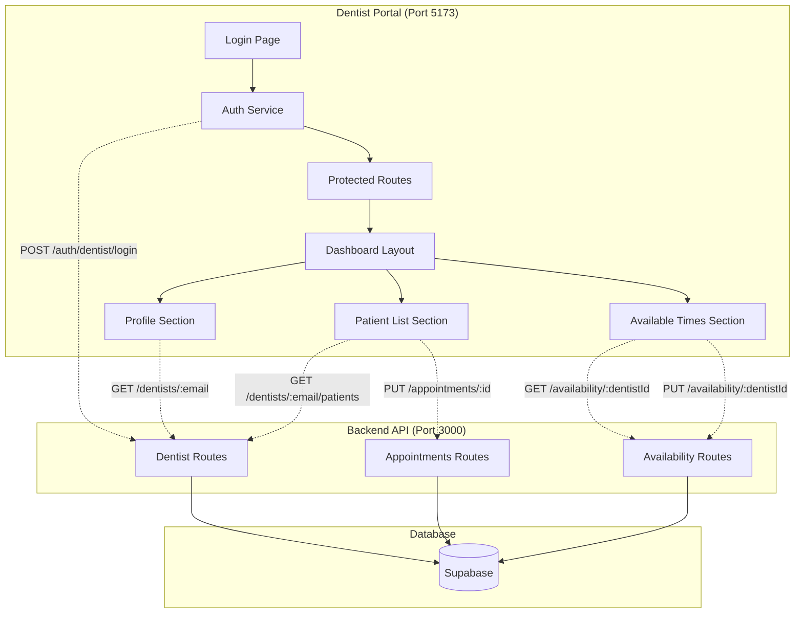

# Design Document

## Overview

The Dentist Portal is a standalone React + Vite application running on port 5173 that provides dentists with a secure, authenticated interface to manage their profile, availability, and patient appointments. The portal follows a modular architecture with protected routes, centralized state management, and integration with the existing backend API.

The application leverages the existing backend infrastructure (running on port 3000) and extends it with dentist-specific endpoints. It uses React Router for navigation, Axios for API communication, TailwindCSS for styling, and localStorage/JWT for session management.

## Architecture

### High-Level Architecture



### Technology Stack

- **Frontend Framework**: React 18 with TypeScript
- **Build Tool**: Vite 5
- **Routing**: React Router DOM v6
- **HTTP Client**: Axios
- **Styling**: TailwindCSS with shadcn/ui components
- **State Management**: React Context API + Custom Hooks
- **Authentication**: JWT tokens stored in localStorage
- **Form Handling**: React Hook Form with Zod validation
- **Icons**: Lucide React

### Project Structure

```
dentist-portal/
├── public/
│   └── favicon.ico
├── src/
│   ├── components/
│   │   ├── ui/              # shadcn/ui components
│   │   ├── layout/
│   │   │   ├── DashboardLayout.tsx
│   │   │   └── Sidebar.tsx
│   │   ├── profile/
│   │   │   └── ProfileCard.tsx
│   │   ├── availability/
│   │   │   ├── AvailabilityList.tsx
│   │   │   └── TimeSlotEditor.tsx
│   │   └── patients/
│   │       ├── PatientList.tsx
│   │       └── AppointmentCard.tsx
│   ├── contexts/
│   │   └── AuthContext.tsx
│   ├── hooks/
│   │   ├── useAuth.ts
│   │   ├── useDentist.ts
│   │   ├── usePatients.ts
│   │   └── useAvailability.ts
│   ├── pages/
│   │   ├── Login.tsx
│   │   ├── Dashboard.tsx
│   │   ├── Profile.tsx
│   │   ├── AvailableTimes.tsx
│   │   └── Patients.tsx
│   ├── services/
│   │   ├── api.ts           # Axios instance
│   │   ├── auth.service.ts
│   │   ├── dentist.service.ts
│   │   └── appointment.service.ts
│   ├── types/
│   │   ├── dentist.types.ts
│   │   ├── appointment.types.ts
│   │   └── auth.types.ts
│   ├── utils/
│   │   ├── storage.ts       # localStorage helpers
│   │   └── date.ts          # date formatting
│   ├── App.tsx
│   ├── main.tsx
│   └── index.css
├── .env
├── index.html
├── package.json
├── tsconfig.json
├── vite.config.ts
└── tailwind.config.ts
```

## Components and Interfaces

### Authentication System

#### AuthContext
Provides global authentication state and methods throughout the application.

```typescript
interface AuthContextType {
  dentist: Dentist | null;
  isAuthenticated: boolean;
  isLoading: boolean;
  login: (email: string) => Promise<void>;
  logout: () => void;
}
```

#### Login Page Component
- Email input field with validation
- Submit button with loading state
- Error message display
- Redirects to dashboard on success

**Requirements Addressed**: 1.1, 1.2, 1.3, 1.4, 1.5

#### Protected Route Component
- Wraps dashboard routes
- Checks authentication status
- Redirects to login if unauthenticated
- Validates session on mount

**Requirements Addressed**: 7.1, 7.2, 7.3, 7.4

### Dashboard Layout

#### DashboardLayout Component
- Responsive container with sidebar and main content area
- Handles mobile menu toggle
- Provides consistent layout across all dashboard pages

#### Sidebar Component
- Navigation links: Profile, Available Times, Patients
- Active route highlighting
- Logout button
- Responsive collapse on mobile

**Requirements Addressed**: 6.1, 6.2, 6.3, 6.4

### Profile Section

#### ProfileCard Component
Displays dentist information in a card format:
- Profile photo (avatar)
- Full name
- Specialization
- Email address
- Additional metadata (years of experience, education, etc.)

**Data Flow**:
1. Component mounts
2. Fetch dentist data via `useDentist` hook
3. Display loading skeleton
4. Render profile information
5. Handle errors with error message

**Requirements Addressed**: 2.1, 2.2, 2.3, 2.4

### Available Times Section

#### AvailabilityList Component
Displays all availability slots in a table or card grid:
- Date and time range
- Status (available/booked)
- Edit button for each slot

#### TimeSlotEditor Component
Modal or inline editor for modifying availability:
- Date picker
- Time range selector (start/end)
- Save and cancel buttons
- Validation for time conflicts

**Data Flow**:
1. Fetch availability via `useAvailability` hook
2. Display slots in chronological order
3. On edit click, open TimeSlotEditor
4. Submit changes to backend
5. Refresh availability list on success

**Requirements Addressed**: 3.1, 3.2, 3.3, 3.4

### Patient List Section

#### PatientList Component
Container for all patient appointments:
- Filters (upcoming, completed, all)
- Sort by date
- Search by patient name

#### AppointmentCard Component
Individual appointment display:
- Patient name
- Appointment date and time
- Status badge (pending/completed)
- "Mark as Completed" button (only for pending)
- Visual distinction for completed appointments

**Data Flow**:
1. Fetch patients via `usePatients` hook
2. Display appointments sorted by date
3. On "Mark as Completed" click:
   - Show confirmation
   - Send PUT request to backend
   - Update local state optimistically
   - Show success/error toast
4. Refresh list on success

**Requirements Addressed**: 4.1, 4.2, 4.3, 4.4, 5.1, 5.2, 5.3, 5.4, 5.5

## Data Models

### Dentist
```typescript
interface Dentist {
  id: string;
  email: string;
  full_name: string;
  specialization: string;
  photo_url?: string;
  years_of_experience?: number;
  education?: string;
  bio?: string;
  created_at: string;
  updated_at: string;
}
```

### Appointment
```typescript
interface Appointment {
  id: string;
  patient_id: string;
  dentist_id: string;
  patient_name: string;
  patient_email: string;
  appointment_date: string;
  appointment_type: string;
  status: 'pending' | 'completed' | 'cancelled';
  notes?: string;
  created_at: string;
  updated_at: string;
}
```

### AvailabilitySlot
```typescript
interface AvailabilitySlot {
  id: string;
  dentist_id: string;
  start_time: string;
  end_time: string;
  is_available: boolean;
  created_at: string;
  updated_at: string;
}
```

### AuthSession
```typescript
interface AuthSession {
  token: string;
  dentist: Dentist;
  expiresAt: number;
}
```

## API Integration

### Backend Endpoints

#### Authentication
- `POST /api/auth/dentist/login`
  - Body: `{ email: string }`
  - Response: `{ token: string, dentist: Dentist }`
  - Creates JWT token for dentist session

#### Dentist Profile
- `GET /api/dentists/:email`
  - Response: `Dentist`
  - Fetches dentist profile by email

#### Patients
- `GET /api/dentists/:email/patients`
  - Query params: `status?: string, from?: string, to?: string`
  - Response: `Appointment[]`
  - Fetches all appointments for the dentist

#### Appointments
- `PUT /api/appointments/:id`
  - Body: `{ status: string }`
  - Response: `Appointment`
  - Updates appointment status

#### Availability
- `GET /api/availability/:dentistId`
  - Response: `AvailabilitySlot[]`
  - Fetches all availability slots

- `PUT /api/availability/:dentistId`
  - Body: `{ slots: AvailabilitySlot[] }`
  - Response: `AvailabilitySlot[]`
  - Updates availability slots

### API Service Layer

#### api.ts
Axios instance with:
- Base URL configuration
- Request interceptor (adds auth token)
- Response interceptor (handles errors)
- Automatic token refresh logic

```typescript
const api = axios.create({
  baseURL: import.meta.env.VITE_API_URL || 'http://localhost:3000/api',
  timeout: 10000,
});

// Request interceptor
api.interceptors.request.use((config) => {
  const token = getAuthToken();
  if (token) {
    config.headers.Authorization = `Bearer ${token}`;
  }
  return config;
});

// Response interceptor
api.interceptors.response.use(
  (response) => response,
  (error) => {
    if (error.response?.status === 401) {
      // Clear session and redirect to login
      clearAuthSession();
      window.location.href = '/login';
    }
    return Promise.reject(error);
  }
);
```

#### auth.service.ts
```typescript
export const authService = {
  login: async (email: string): Promise<AuthSession> => {
    const response = await api.post('/auth/dentist/login', { email });
    return response.data;
  },
  
  validateSession: async (): Promise<boolean> => {
    try {
      await api.get('/auth/validate');
      return true;
    } catch {
      return false;
    }
  },
};
```

#### dentist.service.ts
```typescript
export const dentistService = {
  getByEmail: async (email: string): Promise<Dentist> => {
    const response = await api.get(`/dentists/${email}`);
    return response.data;
  },
  
  getPatients: async (email: string, filters?: AppointmentFilters): Promise<Appointment[]> => {
    const response = await api.get(`/dentists/${email}/patients`, { params: filters });
    return response.data;
  },
};
```

#### appointment.service.ts
```typescript
export const appointmentService = {
  updateStatus: async (id: string, status: string): Promise<Appointment> => {
    const response = await api.put(`/appointments/${id}`, { status });
    return response.data;
  },
};
```

## Error Handling

### Error Types
1. **Network Errors**: Connection failures, timeouts
2. **Authentication Errors**: Invalid credentials, expired sessions
3. **Validation Errors**: Invalid input data
4. **Server Errors**: 500 errors from backend

### Error Handling Strategy

#### Global Error Boundary
React Error Boundary component to catch rendering errors:
```typescript
<ErrorBoundary fallback={<ErrorPage />}>
  <App />
</ErrorBoundary>
```

#### API Error Handling
- Axios interceptor catches all API errors
- 401 errors trigger automatic logout
- Other errors display toast notifications
- Retry logic for transient failures

#### Form Validation
- Client-side validation using Zod schemas
- Real-time validation feedback
- Server-side validation errors displayed inline

#### Loading States
- Skeleton loaders for data fetching
- Disabled buttons during submission
- Loading spinners for async operations

**Requirements Addressed**: 1.4, 2.4, 5.4

## Authentication & Session Management

### Login Flow
1. User enters email on login page
2. Frontend validates email format
3. POST request to `/api/auth/dentist/login`
4. Backend verifies email exists in dentists table
5. Backend generates JWT token
6. Frontend stores token and dentist data in localStorage
7. Redirect to dashboard

### Session Storage
```typescript
// Storage structure in localStorage
{
  "dentist_auth": {
    "token": "eyJhbGc...",
    "dentist": { ...dentistData },
    "expiresAt": 1234567890
  }
}
```

### Session Validation
- Check on app initialization
- Validate token expiration
- Verify token with backend on protected route access
- Auto-logout on token expiration

### Logout Flow
1. User clicks logout button
2. Clear localStorage
3. Clear AuthContext state
4. Redirect to login page

**Requirements Addressed**: 1.5, 7.1, 7.2, 7.3, 7.4

## Routing Structure

```typescript
<Routes>
  <Route path="/login" element={<Login />} />
  
  <Route element={<ProtectedRoute />}>
    <Route path="/" element={<DashboardLayout />}>
      <Route index element={<Navigate to="/profile" />} />
      <Route path="profile" element={<Profile />} />
      <Route path="availability" element={<AvailableTimes />} />
      <Route path="patients" element={<Patients />} />
    </Route>
  </Route>
  
  <Route path="*" element={<NotFound />} />
</Routes>
```

**Requirements Addressed**: 6.1, 6.2, 7.1

## UI/UX Design

### Design System

#### Colors
- Primary: Blue (#3B82F6)
- Success: Green (#10B981)
- Warning: Yellow (#F59E0B)
- Danger: Red (#EF4444)
- Neutral: Gray scale

#### Typography
- Font Family: Inter (system font fallback)
- Headings: Bold, larger sizes
- Body: Regular weight, readable size (16px base)

#### Spacing
- Consistent 8px grid system
- Component padding: 16px, 24px, 32px
- Section margins: 24px, 48px

#### Components
- Buttons: Rounded corners, hover states, loading states
- Cards: Subtle shadows, white background
- Inputs: Border focus states, error states
- Tables: Striped rows, hover effects

### Responsive Design

#### Breakpoints
- Mobile: < 640px
- Tablet: 640px - 1024px
- Desktop: > 1024px

#### Mobile Adaptations
- Sidebar collapses to hamburger menu
- Tables convert to card layout
- Reduced padding and margins
- Touch-friendly button sizes (min 44px)

#### Desktop Optimizations
- Fixed sidebar navigation
- Multi-column layouts
- Hover interactions
- Keyboard shortcuts

**Requirements Addressed**: 6.4, 8.1, 8.2, 8.3, 8.4, 8.5

## Testing Strategy

### Unit Tests
- Component rendering tests
- Hook logic tests
- Service function tests
- Utility function tests

### Integration Tests
- Authentication flow
- API integration
- Form submissions
- Route navigation

### E2E Tests (Optional)
- Complete user journeys
- Login to dashboard flow
- Appointment status update flow

### Testing Tools
- Vitest for unit tests
- React Testing Library for component tests
- MSW (Mock Service Worker) for API mocking

## Performance Considerations

### Optimization Strategies
1. **Code Splitting**: Lazy load dashboard pages
2. **Memoization**: Use React.memo for expensive components
3. **Debouncing**: Search and filter inputs
4. **Caching**: Cache API responses with React Query (optional)
5. **Image Optimization**: Lazy load images, use appropriate formats

### Bundle Size
- Target: < 500KB initial bundle
- Use tree-shaking
- Minimize dependencies
- Dynamic imports for large components

## Security Considerations

### Authentication Security
- JWT tokens with expiration
- Secure token storage (httpOnly cookies preferred, localStorage acceptable)
- Token validation on every protected route
- Automatic logout on token expiration

### API Security
- CORS configuration
- Request rate limiting (backend)
- Input validation and sanitization
- SQL injection prevention (backend)

### Data Privacy
- No sensitive data in localStorage (except token)
- HTTPS in production
- Secure password handling (if implemented)

## Deployment Configuration

### Environment Variables
```env
VITE_API_URL=http://localhost:3000/api
VITE_APP_NAME=Dentist Portal
```

### Build Configuration
```typescript
// vite.config.ts
export default defineConfig({
  server: {
    port: 5173,
    proxy: {
      '/api': {
        target: 'http://localhost:3000',
        changeOrigin: true,
      },
    },
  },
  build: {
    outDir: 'dist',
    sourcemap: true,
  },
});
```

### Production Considerations
- Enable HTTPS
- Configure proper CORS origins
- Set up error monitoring (Sentry, etc.)
- Configure CDN for static assets
- Set up CI/CD pipeline

## Backend Extensions Required

The following new endpoints need to be added to the existing backend:

### 1. Dentist Authentication Endpoint
```typescript
// POST /api/auth/dentist/login
// Validates dentist email and returns JWT token
```

### 2. Dentist Profile Endpoint
```typescript
// GET /api/dentists/:email
// Returns dentist profile by email
```

### 3. Dentist Patients Endpoint
```typescript
// GET /api/dentists/:email/patients
// Returns all appointments for a dentist with patient details
```

These endpoints will be implemented in the backend as part of the implementation phase.
