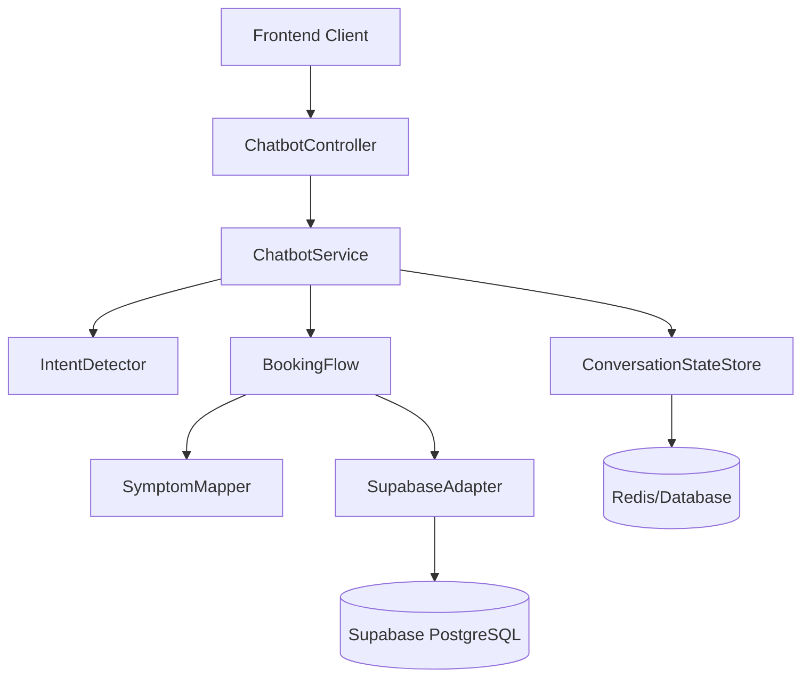

# Design Document: Java Spring Boot Chatbot System

## Overview

The Java Spring Boot Chatbot System provides an AI-powered conversational interface for DentalCareConnect that guides patients through appointment booking. The system uses a stateful conversation architecture with modular components for intent detection, symptom mapping, dentist recommendation, and Supabase database integration.

### Key Design Principles

1. **Stateful Conversations**: Session-based state machine tracking conversation progress
2. **Modular Architecture**: Interface-driven design for extensibility
3. **Database Integration**: Supabase PostgreSQL via REST API
4. **Error Resilience**: Retry logic with exponential backoff
5. **Idempotency**: Prevent duplicate bookings on retries

## Architecture

### High-Level Architecture



### Component Layers

1. **Controller Layer**: REST endpoints for chatbot interaction
2. **Service Layer**: Business logic and state orchestration
3. **Domain Layer**: Core models and interfaces
4. **Data Layer**: Supabase adapter and state persistence

## Components and Interfaces

### 1. ChatbotController

**Purpose**: REST API endpoint for chatbot messages

**Endpoint**: `POST /api/chatbot/message`


**Request/Response**:
```java
// Request DTO
public class ChatMessageRequest {
    private String sessionId;
    private String text;
}

// Response DTO
public class ChatMessageResponse {
    private String sessionId;
    private String message;
    private Map<String, Object> metadata;
    private String state;
    private List<String> options;
}
```

**Implementation**:
```java
@RestController
@RequestMapping("/api/chatbot")
public class ChatbotController {
    
    @Autowired
    private ChatbotService chatbotService;
    
    @PostMapping("/message")
    public ResponseEntity<ChatMessageResponse> handleMessage(
            @Valid @RequestBody ChatMessageRequest request) {
        
        BotMessage response = chatbotService.handleUserInput(
            request.getSessionId(), 
            request.getText()
        );
        
        return ResponseEntity.ok(mapToResponse(response));
    }
    
    @PostMapping("/start")
    public ResponseEntity<ChatMessageResponse> startConversation() {
        String sessionId = UUID.randomUUID().toString();
        BotMessage greeting = chatbotService.startConversation(sessionId);
        return ResponseEntity.ok(mapToResponse(greeting));
    }
}
```

### 2. ChatbotService

**Purpose**: Core orchestration of conversation flow and state management

**Key Methods**:
```java
public interface ChatbotService {
    BotMessage startConversation(String sessionId);
    BotMessage handleUserInput(String sessionId, String userText);
}
```


**Implementation**:
```java
@Service
public class ChatbotServiceImpl implements ChatbotService {
    
    @Autowired
    private ConversationStateStore stateStore;
    
    @Autowired
    private IntentDetector intentDetector;
    
    @Autowired
    private BookingFlow bookingFlow;
    
    @Override
    public BotMessage startConversation(String sessionId) {
        ConversationState state = new ConversationState();
        state.setSessionId(sessionId);
        state.setCurrentState(ConversationStep.START);
        state.setCreatedAt(LocalDateTime.now());
        state.setExpiresAt(LocalDateTime.now().plusMinutes(30));
        
        stateStore.save(state);
        
        return BotMessage.builder()
            .message("Hi! Welcome to DentalCareConnect. How can I help you today?")
            .options(Arrays.asList(
                "Book an Appointment",
                "Ask About Dentists",
                "Payment Information",
                "General Questions"
            ))
            .state(ConversationStep.START.name())
            .build();
    }
    
    @Override
    public BotMessage handleUserInput(String sessionId, String userText) {
        // Retrieve conversation state
        ConversationState state = stateStore.findBySessionId(sessionId)
            .orElseThrow(() -> new SessionNotFoundException(sessionId));
        
        // Check expiration
        if (state.isExpired()) {
            return BotMessage.error("Your session has expired. Please start a new conversation.");
        }
        
        // Process based on current state
        BotMessage response = processMessage(state, userText);
        
        // Update state
        state.setLastUpdated(LocalDateTime.now());
        stateStore.save(state);
        
        return response;
    }
    
    private BotMessage processMessage(ConversationState state, String userText) {
        switch (state.getCurrentState()) {
            case START:
                return handleStartState(state, userText);
            case INTENT_DETECTED:
                return bookingFlow.startBooking(state);
            case COLLECT_NAME:
            case COLLECT_EMAIL:
            case COLLECT_PHONE:
            case COLLECT_SYMPTOMS:
            case SUGGEST_SPECIALIZATION:
            case FETCH_AVAILABILITY:
            case PROPOSE_SLOT:
            case CONFIRM_SLOT:
            case SAVE_APPOINTMENT:
            case PAYMENT_OFFER:
                return bookingFlow.processStep(state, userText);
            case DONE:
                return BotMessage.builder()
                    .message("Your booking is complete! Start a new conversation to book another appointment.")
                    .build();
            default:
                return BotMessage.error("Unknown state. Please start over.");
        }
    }
    
    private BotMessage handleStartState(ConversationState state, String userText) {
        Intent intent = intentDetector.detectIntent(userText);
        
        switch (intent) {
            case BOOKING:
                state.setCurrentState(ConversationStep.INTENT_DETECTED);
                return bookingFlow.startBooking(state);
            case DENTIST_INFO:
                return provideDentistInfo(userText);
            case PAYMENT:
                return providePaymentInfo();
            case GENERAL_INQUIRY:
                return provideGeneralInfo(userText);
            case UNKNOWN:
                return BotMessage.builder()
                    .message("I'm not sure I understand. Could you please choose one of these options?")
                    .options(Arrays.asList("Book Appointment", "Dentist Info", "Payment", "General Help"))
                    .build();
        }
        
        return BotMessage.error("Unable to process request");
    }
}
```

### 3. IntentDetector

**Purpose**: Classify user intent from text input


**Interface**:
```java
public interface IntentDetector {
    Intent detectIntent(String text);
}

public enum Intent {
    BOOKING,
    DENTIST_INFO,
    PAYMENT,
    GENERAL_INQUIRY,
    UNKNOWN
}
```

**Implementation** (Keyword-based, extensible to ML):
```java
@Component
public class KeywordIntentDetector implements IntentDetector {
    
    private static final Map<Intent, List<String>> INTENT_KEYWORDS = Map.of(
        Intent.BOOKING, Arrays.asList("book", "appointment", "schedule", "reserve", "visit"),
        Intent.DENTIST_INFO, Arrays.asList("dentist", "doctor", "specialist", "who", "available"),
        Intent.PAYMENT, Arrays.asList("pay", "payment", "cost", "price", "insurance", "bill"),
        Intent.GENERAL_INQUIRY, Arrays.asList("help", "question", "info", "information", "tell me")
    );
    
    @Override
    public Intent detectIntent(String text) {
        String lowerText = text.toLowerCase();
        
        // Check each intent's keywords
        for (Map.Entry<Intent, List<String>> entry : INTENT_KEYWORDS.entrySet()) {
            for (String keyword : entry.getValue()) {
                if (lowerText.contains(keyword)) {
                    return entry.getKey();
                }
            }
        }
        
        return Intent.UNKNOWN;
    }
}

// Future ML-based implementation
@Component
@Profile("ml")
public class MLIntentDetector implements IntentDetector {
    // Integration with ML model (TensorFlow, OpenNLP, etc.)
    @Override
    public Intent detectIntent(String text) {
        // Call ML model API
        return Intent.UNKNOWN;
    }
}
```

### 4. BookingFlow

**Purpose**: Manage booking conversation flow and state transitions


**Interface**:
```java
public interface BookingFlow {
    BotMessage startBooking(ConversationState state);
    BotMessage processStep(ConversationState state, String userInput);
}
```

**Implementation**:
```java
@Component
public class BookingFlowImpl implements BookingFlow {
    
    @Autowired
    private SymptomMapper symptomMapper;
    
    @Autowired
    private SupabaseAdapter supabaseAdapter;
    
    @Autowired
    private ValidationService validationService;
    
    @Override
    public BotMessage startBooking(ConversationState state) {
        state.setCurrentState(ConversationStep.COLLECT_NAME);
        return BotMessage.builder()
            .message("Great! Let's book your appointment. What's your full name?")
            .state(ConversationStep.COLLECT_NAME.name())
            .build();
    }
    
    @Override
    public BotMessage processStep(ConversationState state, String userInput) {
        switch (state.getCurrentState()) {
            case COLLECT_NAME:
                return collectName(state, userInput);
            case COLLECT_EMAIL:
                return collectEmail(state, userInput);
            case COLLECT_PHONE:
                return collectPhone(state, userInput);
            case COLLECT_SYMPTOMS:
                return collectSymptoms(state, userInput);
            case SUGGEST_SPECIALIZATION:
                return suggestSpecialization(state);
            case FETCH_AVAILABILITY:
                return fetchAvailability(state, userInput);
            case PROPOSE_SLOT:
                return proposeSlot(state, userInput);
            case CONFIRM_SLOT:
                return confirmSlot(state, userInput);
            case SAVE_APPOINTMENT:
                return saveAppointment(state);
            case PAYMENT_OFFER:
                return offerPayment(state, userInput);
            default:
                return BotMessage.error("Invalid state");
        }
    }
    
    private BotMessage collectName(ConversationState state, String name) {
        if (name == null || name.trim().isEmpty()) {
            return BotMessage.builder()
                .message("Please provide your name.")
                .state(ConversationStep.COLLECT_NAME.name())
                .build();
        }
        
        state.getCollectedData().put("name", name.trim());
        state.setCurrentState(ConversationStep.COLLECT_EMAIL);
        
        return BotMessage.builder()
            .message("Thanks, " + name + "! What's your email address?")
            .state(ConversationStep.COLLECT_EMAIL.name())
            .build();
    }
    
    private BotMessage collectEmail(ConversationState state, String email) {
        if (!validationService.isValidEmail(email)) {
            return BotMessage.builder()
                .message("That doesn't look like a valid email. Please try again.")
                .state(ConversationStep.COLLECT_EMAIL.name())
                .build();
        }
        
        state.getCollectedData().put("email", email.trim());
        state.setCurrentState(ConversationStep.COLLECT_PHONE);
        
        return BotMessage.builder()
            .message("Great! And your phone number?")
            .state(ConversationStep.COLLECT_PHONE.name())
            .build();
    }
    
    private BotMessage collectPhone(ConversationState state, String phone) {
        if (!validationService.isValidPhone(phone)) {
            return BotMessage.builder()
                .message("Please provide a valid phone number (10-15 digits).")
                .state(ConversationStep.COLLECT_PHONE.name())
                .build();
        }
        
        state.getCollectedData().put("phone", phone.trim());
        state.setCurrentState(ConversationStep.COLLECT_SYMPTOMS);
        
        return BotMessage.builder()
            .message("Perfect! Now, what dental issue are you experiencing?")
            .state(ConversationStep.COLLECT_SYMPTOMS.name())
            .build();
    }
    
    private BotMessage collectSymptoms(ConversationState state, String symptoms) {
        // Check for uncertainty indicators
        boolean isUncertain = detectUncertainty(symptoms);
        
        state.getCollectedData().put("symptoms", symptoms);
        state.getCollectedData().put("causeIdentified", !isUncertain);
        
        if (isUncertain) {
            String uncertaintyNote = "Patient reports symptoms but is unsure of the cause";
            state.getCollectedData().put("uncertaintyNote", uncertaintyNote);
            
            state.setCurrentState(ConversationStep.SUGGEST_SPECIALIZATION);
            
            return BotMessage.builder()
                .message("It's okay not to know the exact cause. The dentist will help diagnose. Let me find the right specialist for you.")
                .state(ConversationStep.SUGGEST_SPECIALIZATION.name())
                .build();
        }
        
        state.setCurrentState(ConversationStep.SUGGEST_SPECIALIZATION);
        return suggestSpecialization(state);
    }
    
    private boolean detectUncertainty(String text) {
        String lower = text.toLowerCase();
        return lower.contains("don't know") || 
               lower.contains("not sure") || 
               lower.contains("unsure") ||
               lower.contains("no idea") ||
               lower.contains("idk") ||
               lower.contains("dunno") ||
               lower.contains("maybe");
    }
    
    // Additional methods continue...
}
```

### 5. SymptomMapper

**Purpose**: Map patient symptoms to dentist specializations


**Interface**:
```java
public interface SymptomMapper {
    String mapToSpecialization(String symptoms);
}
```

**Implementation**:
```java
@Component
public class SymptomMapperImpl implements SymptomMapper {
    
    @Value("${chatbot.symptom-mapping-config:classpath:symptom-mapping.yml}")
    private Resource mappingConfig;
    
    private Map<String, List<String>> specializationKeywords;
    
    @PostConstruct
    public void init() {
        // Load from config file for easy updates without code changes
        specializationKeywords = loadMappingConfig();
    }
    
    @Override
    public String mapToSpecialization(String symptoms) {
        String lowerSymptoms = symptoms.toLowerCase();
        
        // Check endodontist keywords
        if (containsAny(lowerSymptoms, Arrays.asList("pain", "ache", "toothache", "sensitivity", "nerve"))) {
            return "endodontist";
        }
        
        // Check orthodontist keywords
        if (containsAny(lowerSymptoms, Arrays.asList("braces", "alignment", "crooked", "straighten", "misaligned"))) {
            return "orthodontist";
        }
        
        // Check periodontist keywords
        if (containsAny(lowerSymptoms, Arrays.asList("gum", "bleeding", "swollen", "periodontal", "gums"))) {
            return "periodontist";
        }
        
        // Check prosthodontist keywords
        if (containsAny(lowerSymptoms, Arrays.asList("crown", "filling", "bridge", "denture", "implant"))) {
            return "prosthodontist";
        }
        
        // Check cosmetic dentist keywords
        if (containsAny(lowerSymptoms, Arrays.asList("whitening", "cosmetic", "veneer", "smile", "aesthetic"))) {
            return "cosmetic_dentist";
        }
        
        // Check general dentist keywords
        if (containsAny(lowerSymptoms, Arrays.asList("cleaning", "checkup", "routine", "exam", "cavity"))) {
            return "general_dentist";
        }
        
        // Default to general dentist
        return "general_dentist";
    }
    
    private boolean containsAny(String text, List<String> keywords) {
        return keywords.stream().anyMatch(text::contains);
    }
    
    private Map<String, List<String>> loadMappingConfig() {
        // Load from YAML config file
        // This allows updating mappings without code changes
        return Map.of(
            "endodontist", Arrays.asList("pain", "ache", "toothache"),
            "orthodontist", Arrays.asList("braces", "alignment", "crooked"),
            "periodontist", Arrays.asList("gum", "bleeding", "swollen"),
            "prosthodontist", Arrays.asList("crown", "filling", "bridge"),
            "cosmetic_dentist", Arrays.asList("whitening", "cosmetic", "veneer"),
            "general_dentist", Arrays.asList("cleaning", "checkup", "routine")
        );
    }
}
```

### 6. SupabaseAdapter

**Purpose**: Handle all Supabase database interactions


**Interface**:
```java
public interface SupabaseAdapter {
    List<Dentist> getDentistsBySpecialization(String specialization);
    Patient upsertPatient(PatientInput input);
    Appointment createAppointment(AppointmentInput input);
    List<TimeSlot> getAvailableSlots(UUID dentistId, LocalDate startDate, int days);
    Optional<Appointment> findAppointmentByIdempotencyKey(String key);
}
```

**Implementation**:
```java
@Component
public class SupabaseAdapterImpl implements SupabaseAdapter {
    
    @Value("${supabase.url}")
    private String supabaseUrl;
    
    @Value("${supabase.service-role-key}")
    private String serviceRoleKey;
    
    private RestTemplate restTemplate;
    
    @PostConstruct
    public void init() {
        // Configure RestTemplate with Supabase headers
        restTemplate = new RestTemplate();
        restTemplate.setInterceptors(Collections.singletonList((request, body, execution) -> {
            request.getHeaders().set("apikey", serviceRoleKey);
            request.getHeaders().set("Authorization", "Bearer " + serviceRoleKey);
            request.getHeaders().setContentType(MediaType.APPLICATION_JSON);
            return execution.execute(request, body);
        }));
    }
    
    @Override
    @Retryable(
        value = {RestClientException.class},
        maxAttempts = 3,
        backoff = @Backoff(delay = 1000, multiplier = 2)
    )
    public List<Dentist> getDentistsBySpecialization(String specialization) {
        try {
            String url = String.format("%s/rest/v1/dentists?specialization=eq.%s&order=rating.desc&limit=3",
                supabaseUrl, specialization);
            
            ResponseEntity<Dentist[]> response = restTemplate.getForEntity(url, Dentist[].class);
            
            if (response.getStatusCode().is2xxSuccessful() && response.getBody() != null) {
                return Arrays.asList(response.getBody());
            }
            
            return Collections.emptyList();
            
        } catch (RestClientException e) {
            log.error("Failed to fetch dentists for specialization: {}", specialization, e);
            throw new SupabaseException("Unable to fetch dentists", e);
        }
    }
    
    @Override
    @Retryable(
        value = {RestClientException.class},
        maxAttempts = 3,
        backoff = @Backoff(delay = 1000, multiplier = 2)
    )
    public Patient upsertPatient(PatientInput input) {
        try {
            String url = supabaseUrl + "/rest/v1/patients";
            
            // Upsert using email as unique key
            HttpHeaders headers = new HttpHeaders();
            headers.set("Prefer", "resolution=merge-duplicates");
            
            HttpEntity<PatientInput> request = new HttpEntity<>(input, headers);
            
            ResponseEntity<Patient> response = restTemplate.postForEntity(url, request, Patient.class);
            
            if (response.getStatusCode().is2xxSuccessful() && response.getBody() != null) {
                return response.getBody();
            }
            
            throw new SupabaseException("Failed to upsert patient");
            
        } catch (RestClientException e) {
            log.error("Failed to upsert patient: {}", input.getEmail(), e);
            throw new SupabaseException("Unable to save patient", e);
        }
    }
    
    @Override
    @Retryable(
        value = {RestClientException.class},
        maxAttempts = 3,
        backoff = @Backoff(delay = 1000, multiplier = 2)
    )
    public Appointment createAppointment(AppointmentInput input) {
        try {
            // Check for duplicate using idempotency key
            Optional<Appointment> existing = findAppointmentByIdempotencyKey(input.getIdempotencyKey());
            if (existing.isPresent()) {
                log.info("Duplicate appointment detected, returning existing: {}", existing.get().getId());
                return existing.get();
            }
            
            String url = supabaseUrl + "/rest/v1/appointments";
            
            HttpEntity<AppointmentInput> request = new HttpEntity<>(input);
            
            ResponseEntity<Appointment> response = restTemplate.postForEntity(url, request, Appointment.class);
            
            if (response.getStatusCode().is2xxSuccessful() && response.getBody() != null) {
                return response.getBody();
            }
            
            throw new SupabaseException("Failed to create appointment");
            
        } catch (RestClientException e) {
            log.error("Failed to create appointment", e);
            throw new SupabaseException("Unable to save appointment", e);
        }
    }
    
    @Override
    public List<TimeSlot> getAvailableSlots(UUID dentistId, LocalDate startDate, int days) {
        try {
            // First, try to get slots from JSONB availability field
            List<TimeSlot> slots = getSlotsFromJsonbAvailability(dentistId, startDate, days);
            
            if (!slots.isEmpty()) {
                return slots;
            }
            
            // Fallback: query normalized dentist_slots table
            return getSlotsFromNormalizedTable(dentistId, startDate, days);
            
        } catch (Exception e) {
            log.error("Failed to fetch available slots for dentist: {}", dentistId, e);
            return Collections.emptyList();
        }
    }
    
    private List<TimeSlot> getSlotsFromJsonbAvailability(UUID dentistId, LocalDate startDate, int days) {
        // Query dentist availability JSONB field
        String url = String.format("%s/rest/v1/dentists?id=eq.%s&select=availability",
            supabaseUrl, dentistId);
        
        ResponseEntity<Map[]> response = restTemplate.getForEntity(url, Map[].class);
        
        if (response.getStatusCode().is2xxSuccessful() && response.getBody() != null && response.getBody().length > 0) {
            Map<String, Object> dentist = response.getBody()[0];
            Object availability = dentist.get("availability");
            
            if (availability instanceof Map) {
                return parseJsonbAvailability((Map<String, Object>) availability, dentistId, startDate, days);
            }
        }
        
        return Collections.emptyList();
    }
    
    private List<TimeSlot> parseJsonbAvailability(Map<String, Object> availability, UUID dentistId, LocalDate startDate, int days) {
        List<TimeSlot> slots = new ArrayList<>();
        
        // Parse JSONB structure: {"monday": ["09:00", "14:00"], "tuesday": ["10:00"]}
        for (int i = 0; i < days; i++) {
            LocalDate date = startDate.plusDays(i);
            String dayOfWeek = date.getDayOfWeek().toString().toLowerCase();
            
            if (availability.containsKey(dayOfWeek)) {
                List<String> times = (List<String>) availability.get(dayOfWeek);
                for (String time : times) {
                    slots.add(TimeSlot.builder()
                        .dentistId(dentistId)
                        .date(date)
                        .time(LocalTime.parse(time))
                        .isAvailable(true)
                        .build());
                }
            }
        }
        
        return slots;
    }
    
    private List<TimeSlot> getSlotsFromNormalizedTable(UUID dentistId, LocalDate startDate, int days) {
        LocalDate endDate = startDate.plusDays(days);
        
        String url = String.format(
            "%s/rest/v1/dentist_slots?dentist_id=eq.%s&date=gte.%s&date=lt.%s&is_available=eq.true",
            supabaseUrl, dentistId, startDate, endDate
        );
        
        ResponseEntity<TimeSlot[]> response = restTemplate.getForEntity(url, TimeSlot[].class);
        
        if (response.getStatusCode().is2xxSuccessful() && response.getBody() != null) {
            return Arrays.asList(response.getBody());
        }
        
        return Collections.emptyList();
    }
    
    @Override
    public Optional<Appointment> findAppointmentByIdempotencyKey(String key) {
        try {
            String url = String.format("%s/rest/v1/appointments?idempotency_key=eq.%s",
                supabaseUrl, key);
            
            ResponseEntity<Appointment[]> response = restTemplate.getForEntity(url, Appointment[].class);
            
            if (response.getStatusCode().is2xxSuccessful() && 
                response.getBody() != null && 
                response.getBody().length > 0) {
                return Optional.of(response.getBody()[0]);
            }
            
            return Optional.empty();
            
        } catch (RestClientException e) {
            log.error("Failed to check idempotency key: {}", key, e);
            return Optional.empty();
        }
    }
}
```

### 7. ConversationStateStore

**Purpose**: Persist and retrieve conversation state


**Interface**:
```java
public interface ConversationStateStore {
    void save(ConversationState state);
    Optional<ConversationState> findBySessionId(String sessionId);
    void deleteExpired();
}
```

**Redis Implementation**:
```java
@Component
@Profile("redis")
public class RedisConversationStateStore implements ConversationStateStore {
    
    @Autowired
    private RedisTemplate<String, ConversationState> redisTemplate;
    
    private static final String KEY_PREFIX = "chatbot:session:";
    private static final Duration TTL = Duration.ofMinutes(30);
    
    @Override
    public void save(ConversationState state) {
        String key = KEY_PREFIX + state.getSessionId();
        redisTemplate.opsForValue().set(key, state, TTL);
    }
    
    @Override
    public Optional<ConversationState> findBySessionId(String sessionId) {
        String key = KEY_PREFIX + sessionId;
        ConversationState state = redisTemplate.opsForValue().get(key);
        return Optional.ofNullable(state);
    }
    
    @Override
    public void deleteExpired() {
        // Redis handles TTL automatically
    }
}
```

**Database Implementation**:
```java
@Component
@Profile("!redis")
public class DatabaseConversationStateStore implements ConversationStateStore {
    
    @Autowired
    private ConversationStateRepository repository;
    
    @Override
    public void save(ConversationState state) {
        repository.save(state);
    }
    
    @Override
    public Optional<ConversationState> findBySessionId(String sessionId) {
        return repository.findBySessionId(sessionId);
    }
    
    @Override
    @Scheduled(fixedRate = 300000) // Every 5 minutes
    public void deleteExpired() {
        repository.deleteByExpiresAtBefore(LocalDateTime.now());
    }
}
```

## Data Models

### Domain Models

```java
@Data
@Builder
public class BotMessage {
    private String message;
    private List<String> options;
    private Map<String, Object> metadata;
    private String state;
    
    public static BotMessage error(String message) {
        return BotMessage.builder()
            .message(message)
            .metadata(Map.of("error", true))
            .build();
    }
}

@Data
@Entity
@Table(name = "conversation_states")
public class ConversationState {
    @Id
    private String sessionId;
    
    @Enumerated(EnumType.STRING)
    private ConversationStep currentState;
    
    @Type(type = "jsonb")
    @Column(columnDefinition = "jsonb")
    private Map<String, Object> collectedData = new HashMap<>();
    
    private LocalDateTime createdAt;
    private LocalDateTime lastUpdated;
    private LocalDateTime expiresAt;
    
    public boolean isExpired() {
        return LocalDateTime.now().isAfter(expiresAt);
    }
}

public enum ConversationStep {
    START,
    INTENT_DETECTED,
    COLLECT_NAME,
    COLLECT_EMAIL,
    COLLECT_PHONE,
    COLLECT_SYMPTOMS,
    SUGGEST_SPECIALIZATION,
    FETCH_AVAILABILITY,
    PROPOSE_SLOT,
    CONFIRM_SLOT,
    SAVE_APPOINTMENT,
    PAYMENT_OFFER,
    DONE
}

@Data
@Builder
public class Dentist {
    private UUID id;
    private String name;
    private String specialization;
    private BigDecimal rating;
    private Object availability; // JSONB or parsed structure
    private LocalDateTime createdAt;
}

@Data
@Builder
public class Patient {
    private UUID id;
    private String name;
    private String email;
    private String phone;
    private LocalDateTime createdAt;
}

@Data
@Builder
public class Appointment {
    private UUID id;
    private UUID patientId;
    private UUID dentistId;
    private LocalDate date;
    private LocalTime time;
    private String status;
    private String symptoms;
    private Boolean causeIdentified;
    private String uncertaintyNote;
    private String idempotencyKey;
    private String bookingReference;
    private LocalDateTime createdAt;
}

@Data
@Builder
public class TimeSlot {
    private UUID dentistId;
    private LocalDate date;
    private LocalTime time;
    private Boolean isAvailable;
}
```

### DTOs

```java
@Data
public class PatientInput {
    private String name;
    private String email;
    private String phone;
}

@Data
@Builder
public class AppointmentInput {
    private UUID patientId;
    private UUID dentistId;
    private LocalDate date;
    private LocalTime time;
    private String status;
    private String symptoms;
    private Boolean causeIdentified;
    private String uncertaintyNote;
    private String idempotencyKey;
}

@Data
public class DentistOption {
    private UUID id;
    private String name;
    private String specialization;
    private BigDecimal rating;
    private LocalDateTime nextAvailable;
}
```

## Database Schema

### Supabase Tables

```sql
-- Patients table
CREATE TABLE IF NOT EXISTS public.patients (
    id UUID PRIMARY KEY DEFAULT gen_random_uuid(),
    name TEXT NOT NULL,
    email TEXT UNIQUE NOT NULL,
    phone TEXT,
    created_at TIMESTAMPTZ DEFAULT now()
);

-- Dentists table
CREATE TABLE IF NOT EXISTS public.dentists (
    id UUID PRIMARY KEY DEFAULT gen_random_uuid(),
    name TEXT NOT NULL,
    specialization TEXT NOT NULL,
    availability JSONB,
    rating NUMERIC(3,2) DEFAULT 0.0,
    created_at TIMESTAMPTZ DEFAULT now()
);

-- Appointments table
CREATE TABLE IF NOT EXISTS public.appointments (
    id UUID PRIMARY KEY DEFAULT gen_random_uuid(),
    patient_id UUID REFERENCES public.patients(id) ON DELETE CASCADE,
    dentist_id UUID REFERENCES public.dentists(id) ON DELETE CASCADE,
    date DATE NOT NULL,
    time TIME NOT NULL,
    status TEXT DEFAULT 'confirmed',
    symptoms TEXT,
    cause_identified BOOLEAN DEFAULT true,
    uncertainty_note TEXT,
    idempotency_key TEXT UNIQUE,
    booking_reference TEXT UNIQUE,
    created_at TIMESTAMPTZ DEFAULT now()
);

-- Optional: Normalized slots table
CREATE TABLE IF NOT EXISTS public.dentist_slots (
    id UUID PRIMARY KEY DEFAULT gen_random_uuid(),
    dentist_id UUID REFERENCES public.dentists(id) ON DELETE CASCADE,
    date DATE NOT NULL,
    time TIME NOT NULL,
    is_available BOOLEAN DEFAULT true,
    created_at TIMESTAMPTZ DEFAULT now(),
    UNIQUE(dentist_id, date, time)
);

-- Conversation states table (if not using Redis)
CREATE TABLE IF NOT EXISTS public.conversation_states (
    session_id TEXT PRIMARY KEY,
    current_state TEXT NOT NULL,
    collected_data JSONB DEFAULT '{}',
    created_at TIMESTAMPTZ DEFAULT now(),
    last_updated TIMESTAMPTZ DEFAULT now(),
    expires_at TIMESTAMPTZ NOT NULL
);

-- Indexes
CREATE INDEX idx_appointments_patient ON public.appointments(patient_id);
CREATE INDEX idx_appointments_dentist ON public.appointments(dentist_id);
CREATE INDEX idx_appointments_date ON public.appointments(date);
CREATE INDEX idx_dentists_specialization ON public.dentists(specialization);
CREATE INDEX idx_dentist_slots_dentist_date ON public.dentist_slots(dentist_id, date);
CREATE INDEX idx_conversation_states_expires ON public.conversation_states(expires_at);
```

## Error Handling

### Exception Hierarchy

```java
public class ChatbotException extends RuntimeException {
    public ChatbotException(String message) {
        super(message);
    }
    
    public ChatbotException(String message, Throwable cause) {
        super(message, cause);
    }
}

public class SessionNotFoundException extends ChatbotException {
    public SessionNotFoundException(String sessionId) {
        super("Session not found: " + sessionId);
    }
}

public class SupabaseException extends ChatbotException {
    public SupabaseException(String message) {
        super(message);
    }
    
    public SupabaseException(String message, Throwable cause) {
        super(message, cause);
    }
}

public class ValidationException extends ChatbotException {
    public ValidationException(String message) {
        super(message);
    }
}
```

### Global Exception Handler

```java
@RestControllerAdvice
public class ChatbotExceptionHandler {
    
    @ExceptionHandler(SessionNotFoundException.class)
    public ResponseEntity<ErrorResponse> handleSessionNotFound(SessionNotFoundException ex) {
        return ResponseEntity.status(HttpStatus.NOT_FOUND)
            .body(new ErrorResponse("SESSION_NOT_FOUND", ex.getMessage()));
    }
    
    @ExceptionHandler(SupabaseException.class)
    public ResponseEntity<ErrorResponse> handleSupabaseError(SupabaseException ex) {
        log.error("Supabase error", ex);
        return ResponseEntity.status(HttpStatus.SERVICE_UNAVAILABLE)
            .body(new ErrorResponse("DATABASE_ERROR", "We're experiencing technical difficulties. Please try again."));
    }
    
    @ExceptionHandler(ValidationException.class)
    public ResponseEntity<ErrorResponse> handleValidation(ValidationException ex) {
        return ResponseEntity.status(HttpStatus.BAD_REQUEST)
            .body(new ErrorResponse("VALIDATION_ERROR", ex.getMessage()));
    }
    
    @ExceptionHandler(Exception.class)
    public ResponseEntity<ErrorResponse> handleGeneral(Exception ex) {
        log.error("Unexpected error", ex);
        return ResponseEntity.status(HttpStatus.INTERNAL_SERVER_ERROR)
            .body(new ErrorResponse("INTERNAL_ERROR", "An unexpected error occurred."));
    }
}

@Data
@AllArgsConstructor
public class ErrorResponse {
    private String code;
    private String message;
}
```

## Configuration

### Application Properties

```yaml
# application.yml
spring:
  application:
    name: dentalcare-chatbot
  profiles:
    active: ${SPRING_PROFILE:dev}
  
  # Redis configuration (optional)
  redis:
    host: ${REDIS_HOST:localhost}
    port: ${REDIS_PORT:6379}
    password: ${REDIS_PASSWORD:}

# Supabase configuration
supabase:
  url: ${SUPABASE_URL}
  service-role-key: ${SUPABASE_SERVICE_ROLE_KEY}

# Chatbot configuration
chatbot:
  session-timeout-minutes: 30
  symptom-mapping-config: classpath:symptom-mapping.yml
  max-retry-attempts: 3
  retry-backoff-ms: 1000

# Logging
logging:
  level:
    com.dentalcare.chatbot: DEBUG
    org.springframework.web: INFO
```

### Symptom Mapping Config

```yaml
# symptom-mapping.yml
specializations:
  endodontist:
    keywords:
      - pain
      - ache
      - toothache
      - sensitivity
      - nerve
  
  orthodontist:
    keywords:
      - braces
      - alignment
      - crooked
      - straighten
      - misaligned
  
  periodontist:
    keywords:
      - gum
      - bleeding
      - swollen
      - periodontal
  
  prosthodontist:
    keywords:
      - crown
      - filling
      - bridge
      - denture
      - implant
  
  cosmetic_dentist:
    keywords:
      - whitening
      - cosmetic
      - veneer
      - smile
      - aesthetic
  
  general_dentist:
    keywords:
      - cleaning
      - checkup
      - routine
      - exam
      - cavity
```

## Testing Strategy

### Unit Tests

```java
@SpringBootTest
class ChatbotServiceTest {
    
    @MockBean
    private ConversationStateStore stateStore;
    
    @MockBean
    private IntentDetector intentDetector;
    
    @MockBean
    private BookingFlow bookingFlow;
    
    @Autowired
    private ChatbotService chatbotService;
    
    @Test
    void testStartConversation() {
        String sessionId = UUID.randomUUID().toString();
        BotMessage message = chatbotService.startConversation(sessionId);
        
        assertNotNull(message);
        assertEquals(4, message.getOptions().size());
        verify(stateStore).save(any(ConversationState.class));
    }
    
    @Test
    void testIntentDetection() {
        when(intentDetector.detectIntent("I want to book")).thenReturn(Intent.BOOKING);
        
        Intent result = intentDetector.detectIntent("I want to book");
        
        assertEquals(Intent.BOOKING, result);
    }
}
```

### Integration Tests

```java
@SpringBootTest(webEnvironment = WebEnvironment.RANDOM_PORT)
class ChatbotIntegrationTest {
    
    @Autowired
    private TestRestTemplate restTemplate;
    
    @Test
    void testCompleteBookingFlow() {
        // Start conversation
        ChatMessageResponse start = restTemplate.postForObject(
            "/api/chatbot/start",
            null,
            ChatMessageResponse.class
        );
        
        String sessionId = start.getSessionId();
        
        // Send booking intent
        ChatMessageRequest request = new ChatMessageRequest();
        request.setSessionId(sessionId);
        request.setText("I want to book an appointment");
        
        ChatMessageResponse response = restTemplate.postForObject(
            "/api/chatbot/message",
            request,
            ChatMessageResponse.class
        );
        
        assertNotNull(response);
        assertTrue(response.getMessage().contains("name"));
    }
}
```

## Deployment

### Docker Configuration

```dockerfile
# Dockerfile
FROM openjdk:17-jdk-slim

WORKDIR /app

COPY target/chatbot-service.jar app.jar

EXPOSE 8080

ENTRYPOINT ["java", "-jar", "app.jar"]
```

### Docker Compose

```yaml
# docker-compose.yml
version: '3.8'

services:
  chatbot:
    build: .
    ports:
      - "8080:8080"
    environment:
      - SUPABASE_URL=${SUPABASE_URL}
      - SUPABASE_SERVICE_ROLE_KEY=${SUPABASE_SERVICE_ROLE_KEY}
      - REDIS_HOST=redis
      - SPRING_PROFILE=prod
    depends_on:
      - redis
  
  redis:
    image: redis:7-alpine
    ports:
      - "6379:6379"
```

## Sample Conversation Flow

```
User: "Hi"
Bot: "Hi! Welcome to DentalCareConnect. How can I help you today?"
     Options: [Book an Appointment, Ask About Dentists, Payment Information, General Questions]

User: "I need help with tooth pain"
Bot: "Great! Let's book your appointment. What's your full name?"

User: "John Doe"
Bot: "Thanks, John! What's your email address?"

User: "john@example.com"
Bot: "Great! And your phone number?"

User: "555-1234"
Bot: "Perfect! Now, what dental issue are you experiencing?"

User: "My tooth hurts but I don't know why"
Bot: "It's okay not to know the exact cause. The dentist will help diagnose. Let me find the right specialist for you."
Bot: "Based on your symptoms, I recommend Dr. Sarah Malik, an Endodontist with a 4.8 rating. She's available tomorrow at 10:00 AM. Shall I book that?"

User: "Yes"
Bot: "Let me confirm your booking:
     - Name: John Doe
     - Email: john@example.com
     - Phone: 555-1234
     - Symptom: Tooth pain (cause uncertain)
     - Dentist: Dr. Sarah Malik (Endodontist)
     - Date: Oct 30, 2025
     - Time: 10:00 AM
     
     Does this look correct? Reply 'yes' to confirm or 'edit' to make changes."

User: "Yes"
Bot: "Perfect! Your appointment is confirmed. Appointment ID: 4237. Dr. Sarah Malik will see you on October 30, 2025 at 10:00 AM."
```

## Performance Optimization

1. **Connection Pooling**: Configure HikariCP for database connections
2. **Caching**: Use Redis for conversation state (faster than database)
3. **Async Processing**: Use @Async for non-blocking operations
4. **Rate Limiting**: Implement rate limiting on API endpoints
5. **Monitoring**: Add Micrometer metrics for observability

## Security Considerations

1. **API Key Protection**: Store Supabase keys in environment variables
2. **Input Validation**: Sanitize all user inputs
3. **Rate Limiting**: Prevent abuse with rate limiting
4. **CORS Configuration**: Restrict origins in production
5. **Logging**: Avoid logging sensitive patient data
