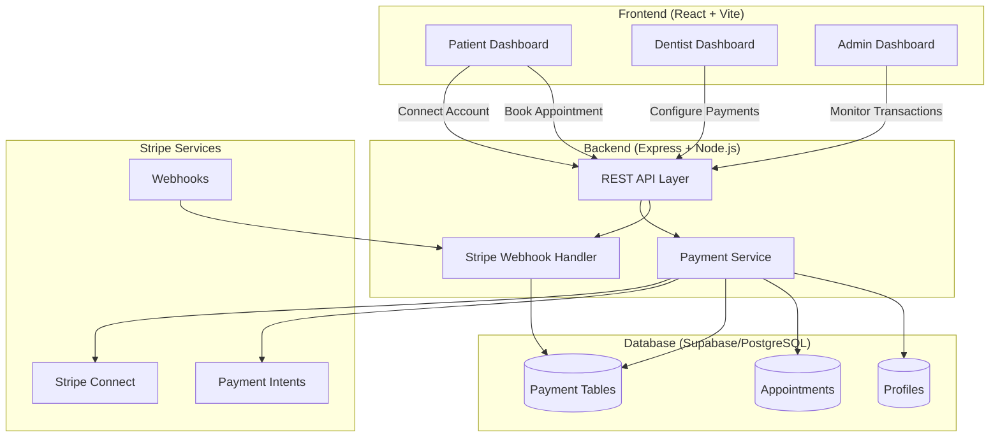
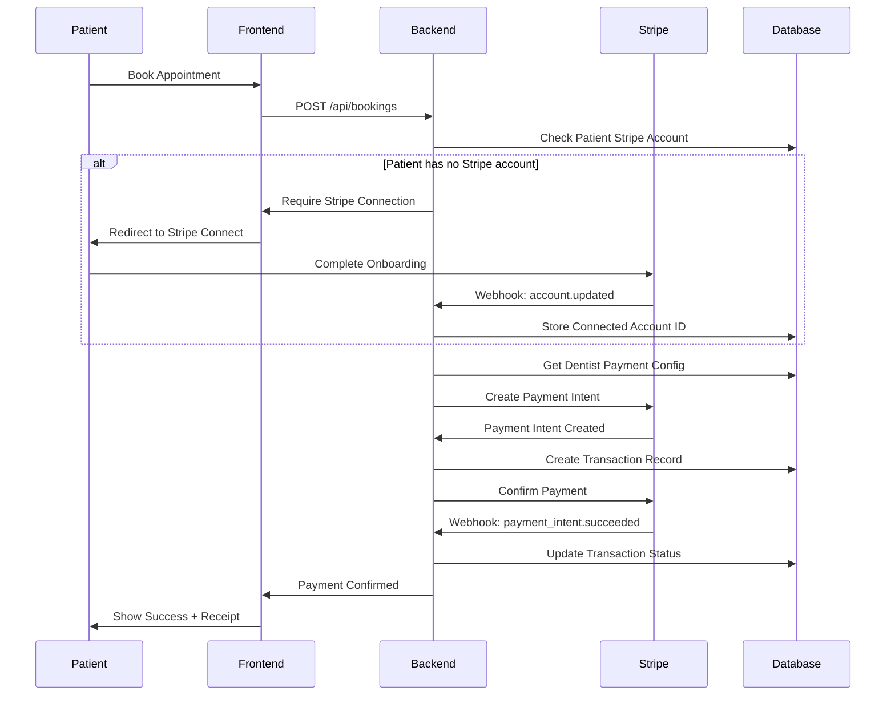

# Stripe Payment Integration Design

## Overview

This design document outlines the architecture for integrating Stripe payment processing into the dental booking platform. The system implements a reverse payment flow where dentists pay patients for booking appointments. The integration uses Stripe Connect for patient payouts, Stripe Payment Intents for processing payments, and includes comprehensive transaction tracking and notification systems.

## Architecture

### High-Level Architecture



### Payment Flow Sequence



## Components and Interfaces

### 1. Database Schema

#### Stripe Accounts Table
```sql
CREATE TABLE public.stripe_accounts (
  id UUID PRIMARY KEY DEFAULT gen_random_uuid(),
  user_id UUID REFERENCES auth.users(id) ON DELETE CASCADE NOT NULL UNIQUE,
  stripe_account_id TEXT NOT NULL UNIQUE,
  account_type TEXT NOT NULL CHECK (account_type IN ('patient', 'dentist')),
  onboarding_complete BOOLEAN DEFAULT false,
  charges_enabled BOOLEAN DEFAULT false,
  payouts_enabled BOOLEAN DEFAULT false,
  created_at TIMESTAMPTZ DEFAULT now(),
  updated_at TIMESTAMPTZ DEFAULT now()
);
```

#### Payment Configurations Table
```sql
CREATE TABLE public.payment_configurations (
  id UUID PRIMARY KEY DEFAULT gen_random_uuid(),
  dentist_id UUID REFERENCES auth.users(id) ON DELETE CASCADE NOT NULL UNIQUE,
  default_payment_amount DECIMAL(10, 2) NOT NULL CHECK (default_payment_amount > 0),
  payment_amounts JSONB DEFAULT '{}'::jsonb,
  stripe_customer_id TEXT,
  default_payment_method_id TEXT,
  created_at TIMESTAMPTZ DEFAULT now(),
  updated_at TIMESTAMPTZ DEFAULT now()
);
```

#### Payment Transactions Table
```sql
CREATE TABLE public.payment_transactions (
  id UUID PRIMARY KEY DEFAULT gen_random_uuid(),
  appointment_id UUID REFERENCES public.appointments(id) ON DELETE SET NULL,
  patient_id UUID REFERENCES auth.users(id) ON DELETE SET NULL NOT NULL,
  dentist_id UUID REFERENCES auth.users(id) ON DELETE SET NULL NOT NULL,
  amount DECIMAL(10, 2) NOT NULL,
  currency TEXT DEFAULT 'usd' NOT NULL,
  stripe_payment_intent_id TEXT UNIQUE,
  stripe_transfer_id TEXT,
  status TEXT NOT NULL CHECK (status IN ('pending', 'processing', 'succeeded', 'failed', 'refunded')),
  failure_reason TEXT,
  metadata JSONB DEFAULT '{}'::jsonb,
  created_at TIMESTAMPTZ DEFAULT now(),
  updated_at TIMESTAMPTZ DEFAULT now()
);
```

#### Payment Methods Table
```sql
CREATE TABLE public.payment_methods (
  id UUID PRIMARY KEY DEFAULT gen_random_uuid(),
  dentist_id UUID REFERENCES auth.users(id) ON DELETE CASCADE NOT NULL,
  stripe_payment_method_id TEXT NOT NULL UNIQUE,
  type TEXT NOT NULL CHECK (type IN ('card', 'bank_account')),
  last4 TEXT NOT NULL,
  brand TEXT,
  is_default BOOLEAN DEFAULT false,
  created_at TIMESTAMPTZ DEFAULT now()
);
```

### 2. Backend API Endpoints

#### Stripe Connect Endpoints
```typescript
// POST /api/payments/connect/onboarding
// Create Stripe Connect onboarding link for patients
interface OnboardingRequest {
  returnUrl: string;
  refreshUrl: string;
}

interface OnboardingResponse {
  url: string;
  accountId: string;
}

// GET /api/payments/connect/status
// Get Stripe Connect account status
interface ConnectStatusResponse {
  connected: boolean;
  accountId?: string;
  chargesEnabled: boolean;
  payoutsEnabled: boolean;
  onboardingComplete: boolean;
}

// DELETE /api/payments/connect/disconnect
// Disconnect Stripe account
interface DisconnectResponse {
  success: boolean;
}
```

#### Payment Configuration Endpoints
```typescript
// GET /api/payments/config
// Get dentist payment configuration
interface PaymentConfigResponse {
  defaultAmount: number;
  customAmounts: Record<string, number>;
  hasPaymentMethod: boolean;
}

// PUT /api/payments/config
// Update dentist payment configuration
interface PaymentConfigRequest {
  defaultAmount: number;
  customAmounts?: Record<string, number>;
}

// POST /api/payments/methods
// Add payment method for dentist
interface AddPaymentMethodRequest {
  paymentMethodId: string; // From Stripe.js
  setAsDefault?: boolean;
}

// GET /api/payments/methods
// List dentist payment methods
interface PaymentMethod {
  id: string;
  type: 'card' | 'bank_account';
  last4: string;
  brand?: string;
  isDefault: boolean;
}

// DELETE /api/payments/methods/:id
// Remove payment method
```

#### Transaction Endpoints
```typescript
// POST /api/payments/process
// Process payment for booking (called internally during booking)
interface ProcessPaymentRequest {
  appointmentId: string;
  patientId: string;
  dentistId: string;
  amount: number;
}

interface ProcessPaymentResponse {
  transactionId: string;
  status: string;
  paymentIntentId: string;
}

// GET /api/payments/transactions
// List transactions (filtered by user role)
interface TransactionListQuery {
  status?: string;
  startDate?: string;
  endDate?: string;
  limit?: number;
  offset?: number;
}

interface Transaction {
  id: string;
  appointmentId: string;
  patientName: string;
  dentistName: string;
  amount: number;
  currency: string;
  status: string;
  failureReason?: string;
  createdAt: string;
}

// GET /api/payments/transactions/:id
// Get transaction details
interface TransactionDetail extends Transaction {
  stripePaymentIntentId: string;
  stripeTransferId?: string;
  metadata: Record<string, any>;
}

// GET /api/payments/transactions/:id/receipt
// Download transaction receipt (PDF)

// POST /api/payments/webhooks/stripe
// Stripe webhook endpoint (handles payment events)
```

### 3. Frontend Components

#### Patient Components
```typescript
// StripeConnectButton.tsx
// Button to initiate Stripe Connect onboarding
interface StripeConnectButtonProps {
  onSuccess?: () => void;
  onError?: (error: Error) => void;
}

// PaymentHistory.tsx
// Display patient payment history
interface PaymentHistoryProps {
  patientId: string;
}

// StripeAccountStatus.tsx
// Display Stripe account connection status
interface StripeAccountStatusProps {
  showActions?: boolean;
}
```

#### Dentist Components
```typescript
// PaymentConfigForm.tsx
// Form to configure payment amounts
interface PaymentConfigFormProps {
  onSave?: () => void;
}

// PaymentMethodManager.tsx
// Manage payment methods (add/remove/set default)
interface PaymentMethodManagerProps {
  dentistId: string;
}

// PaymentReceipts.tsx
// View and download payment receipts
interface PaymentReceiptsProps {
  dentistId: string;
}
```

#### Admin Components
```typescript
// PaymentDashboard.tsx
// Admin view of all payment transactions
interface PaymentDashboardProps {
  filters?: TransactionFilters;
}

// TransactionDetails.tsx
// Detailed view of a single transaction
interface TransactionDetailsProps {
  transactionId: string;
}
```

### 4. Services Layer

#### PaymentService
```typescript
class PaymentService {
  // Stripe Connect operations
  async createConnectAccount(userId: string): Promise<string>;
  async createOnboardingLink(accountId: string, returnUrl: string, refreshUrl: string): Promise<string>;
  async getAccountStatus(userId: string): Promise<ConnectAccountStatus>;
  async disconnectAccount(userId: string): Promise<void>;
  
  // Payment configuration
  async getPaymentConfig(dentistId: string): Promise<PaymentConfig>;
  async updatePaymentConfig(dentistId: string, config: PaymentConfigUpdate): Promise<void>;
  
  // Payment methods
  async addPaymentMethod(dentistId: string, paymentMethodId: string, setAsDefault: boolean): Promise<void>;
  async listPaymentMethods(dentistId: string): Promise<PaymentMethod[]>;
  async removePaymentMethod(dentistId: string, methodId: string): Promise<void>;
  async setDefaultPaymentMethod(dentistId: string, methodId: string): Promise<void>;
  
  // Payment processing
  async processPayment(appointmentId: string, patientId: string, dentistId: string): Promise<Transaction>;
  async createPaymentIntent(amount: number, dentistId: string, patientAccountId: string): Promise<string>;
  async confirmPayment(paymentIntentId: string): Promise<void>;
  
  // Transactions
  async getTransaction(transactionId: string): Promise<TransactionDetail>;
  async listTransactions(filters: TransactionFilters): Promise<Transaction[]>;
  async generateReceipt(transactionId: string): Promise<Buffer>;
  
  // Webhooks
  async handleWebhook(event: Stripe.Event): Promise<void>;
}
```

#### NotificationService
```typescript
class NotificationService {
  async sendPaymentSuccessNotification(transactionId: string): Promise<void>;
  async sendPaymentFailureNotification(transactionId: string): Promise<void>;
  async sendReceiptEmail(transactionId: string, recipientEmail: string): Promise<void>;
}
```

## Data Models

### TypeScript Interfaces

```typescript
interface StripeAccount {
  id: string;
  userId: string;
  stripeAccountId: string;
  accountType: 'patient' | 'dentist';
  onboardingComplete: boolean;
  chargesEnabled: boolean;
  payoutsEnabled: boolean;
  createdAt: Date;
  updatedAt: Date;
}

interface PaymentConfiguration {
  id: string;
  dentistId: string;
  defaultPaymentAmount: number;
  paymentAmounts: Record<string, number>; // appointment_type -> amount
  stripeCustomerId?: string;
  defaultPaymentMethodId?: string;
  createdAt: Date;
  updatedAt: Date;
}

interface PaymentTransaction {
  id: string;
  appointmentId?: string;
  patientId: string;
  dentistId: string;
  amount: number;
  currency: string;
  stripePaymentIntentId?: string;
  stripeTransferId?: string;
  status: 'pending' | 'processing' | 'succeeded' | 'failed' | 'refunded';
  failureReason?: string;
  metadata: Record<string, any>;
  createdAt: Date;
  updatedAt: Date;
}

interface PaymentMethod {
  id: string;
  dentistId: string;
  stripePaymentMethodId: string;
  type: 'card' | 'bank_account';
  last4: string;
  brand?: string;
  isDefault: boolean;
  createdAt: Date;
}
```

## Error Handling

### Error Types

```typescript
enum PaymentErrorCode {
  STRIPE_ACCOUNT_NOT_CONNECTED = 'STRIPE_ACCOUNT_NOT_CONNECTED',
  STRIPE_ACCOUNT_NOT_VERIFIED = 'STRIPE_ACCOUNT_NOT_VERIFIED',
  NO_PAYMENT_METHOD = 'NO_PAYMENT_METHOD',
  PAYMENT_INTENT_FAILED = 'PAYMENT_INTENT_FAILED',
  INSUFFICIENT_FUNDS = 'INSUFFICIENT_FUNDS',
  INVALID_AMOUNT = 'INVALID_AMOUNT',
  WEBHOOK_VERIFICATION_FAILED = 'WEBHOOK_VERIFICATION_FAILED',
  TRANSACTION_NOT_FOUND = 'TRANSACTION_NOT_FOUND',
  UNAUTHORIZED = 'UNAUTHORIZED'
}

class PaymentError extends Error {
  constructor(
    public code: PaymentErrorCode,
    message: string,
    public details?: any
  ) {
    super(message);
    this.name = 'PaymentError';
  }
}
```

### Error Handling Strategy

1. **Stripe API Errors**: Catch and transform Stripe errors into application-specific errors
2. **Webhook Failures**: Log failed webhooks and implement retry mechanism
3. **Payment Failures**: Store failure reason and notify both parties
4. **Validation Errors**: Return clear error messages for invalid inputs
5. **Network Errors**: Implement exponential backoff for retries

## Testing Strategy

### Unit Tests

1. **PaymentService Tests**
   - Test Stripe Connect account creation
   - Test payment intent creation and confirmation
   - Test payment configuration CRUD operations
   - Test payment method management
   - Test transaction queries and filtering

2. **Webhook Handler Tests**
   - Test webhook signature verification
   - Test handling of different event types
   - Test idempotency of webhook processing

3. **Validation Tests**
   - Test payment amount validation
   - Test payment configuration validation
   - Test user authorization checks

### Integration Tests

1. **End-to-End Payment Flow**
   - Test complete booking with payment flow
   - Test payment failure scenarios
   - Test refund processing

2. **Stripe Connect Flow**
   - Test onboarding link generation
   - Test account status updates via webhooks

3. **API Endpoint Tests**
   - Test all payment endpoints with various scenarios
   - Test authentication and authorization
   - Test error responses

### Manual Testing Checklist

1. Patient connects Stripe account successfully
2. Dentist configures payment amounts
3. Dentist adds and manages payment methods
4. Payment processes successfully on booking
5. Payment failure is handled gracefully
6. Notifications are sent correctly
7. Transaction history displays accurately
8. Receipts generate and download correctly
9. Admin can view all transactions
10. Webhook events are processed correctly

## Security Considerations

1. **API Key Management**: Store Stripe API keys in environment variables, never in code
2. **Webhook Signature Verification**: Always verify webhook signatures to prevent spoofing
3. **Row Level Security**: Implement RLS policies to ensure users can only access their own payment data
4. **PCI Compliance**: Use Stripe.js and Elements to handle card data, never store card details
5. **Authorization**: Verify user roles before allowing payment operations
6. **Idempotency**: Use idempotency keys for payment operations to prevent duplicate charges
7. **Audit Logging**: Log all payment operations for compliance and debugging
8. **Rate Limiting**: Implement rate limiting on payment endpoints to prevent abuse

## Performance Considerations

1. **Database Indexing**: Add indexes on frequently queried columns (user_id, appointment_id, status, created_at)
2. **Caching**: Cache payment configurations and Stripe account status
3. **Async Processing**: Process webhooks asynchronously to avoid blocking
4. **Pagination**: Implement pagination for transaction lists
5. **Connection Pooling**: Use connection pooling for database queries

## Deployment Considerations

1. **Environment Variables**:
   - `STRIPE_SECRET_KEY`: Stripe secret API key
   - `STRIPE_PUBLISHABLE_KEY`: Stripe publishable key
   - `STRIPE_WEBHOOK_SECRET`: Webhook signing secret
   - `STRIPE_CONNECT_CLIENT_ID`: Stripe Connect client ID

2. **Stripe Webhook Configuration**: Register webhook endpoint in Stripe Dashboard

3. **Database Migrations**: Run migrations to create payment tables

4. **Testing**: Use Stripe test mode for development and staging environments

5. **Monitoring**: Set up alerts for payment failures and webhook processing errors
