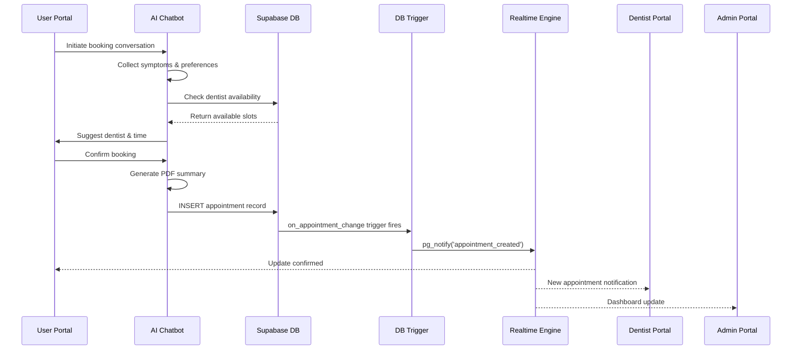
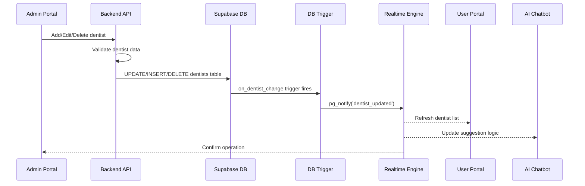
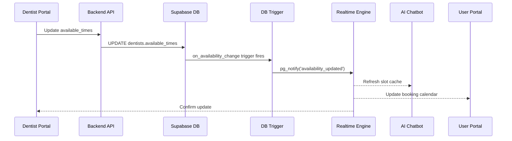
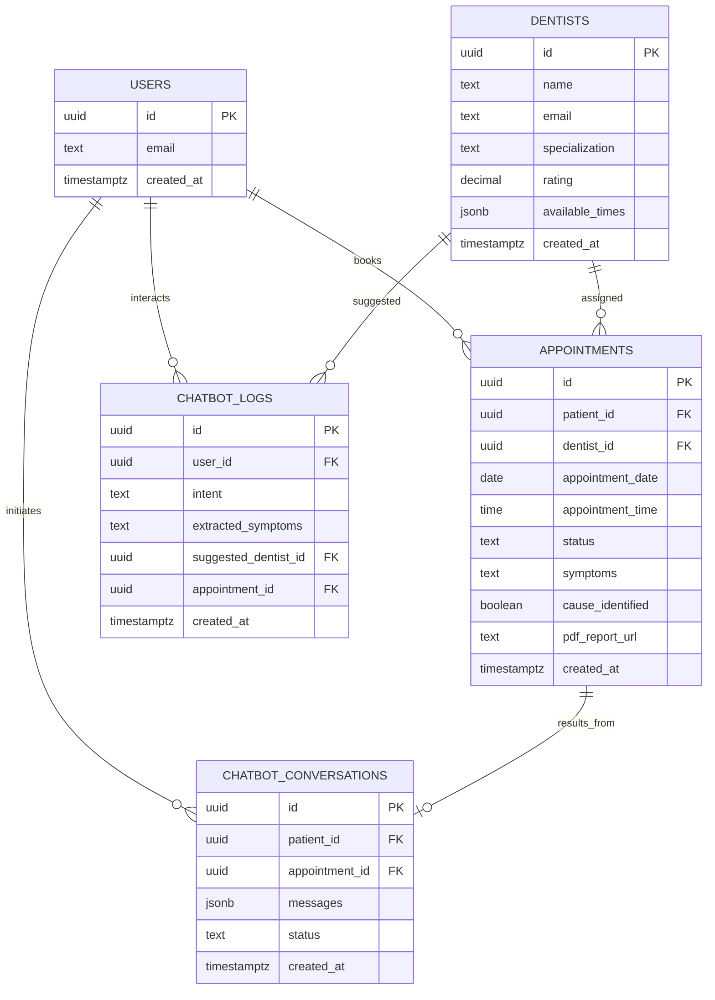
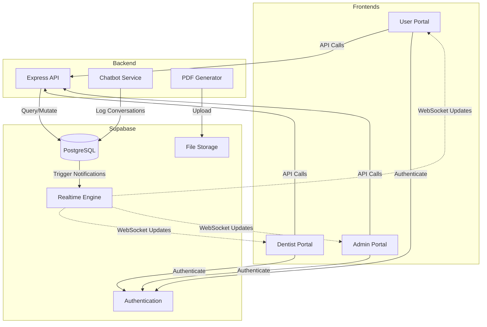
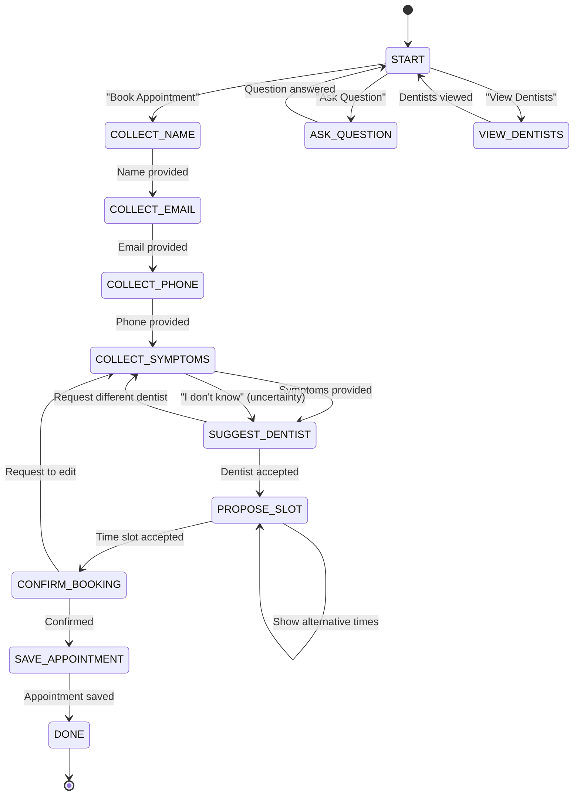

# DentalCareConnect — Full Multi-System Sync Design

## Executive Overview

This design document outlines the enhancement of the existing DentalCareConnect platform to achieve seamless real-time synchronization across three independent portals: User Portal, Dentist Portal, and Admin Portal. The system leverages Supabase PostgreSQL with real-time capabilities, ensuring instant data propagation across all interfaces without manual refresh requirements.

## Strategic Objectives

- Establish bidirectional real-time synchronization between all portals through a unified database layer
- Extend AI chatbot capabilities to generate comprehensive PDF summaries with symptom analysis
- Implement robust dentist management with availability synchronization across all systems
- Ensure data consistency and immediate reflection of changes across all user interfaces
- Maintain existing visual design consistency while enhancing functionality

## System Architecture

### Architectural Layers

The platform consists of four primary architectural layers working in concert:

#### 1. Frontend Applications Layer

Three independent React + TypeScript applications with shared synchronization patterns:

**User Portal**
- Primary booking interface for patients
- AI chatbot interaction for appointment scheduling
- Dentist profile browsing and selection
- Personal appointment dashboard
- PDF report viewing

**Dentist Portal**
- Assignment-specific appointment viewing
- Appointment status management (pending → completed)
- Availability schedule editing
- Patient summary and PDF report access
- Real-time notification of new bookings

**Admin Portal**
- Comprehensive dentist management (CRUD operations)
- Global appointment oversight
- PDF summary access for all appointments
- System-wide availability management
- Analytics dashboard

#### 2. Database Synchronization Layer

Centralized Supabase PostgreSQL database serving as the single source of truth:

**Core Principle**: All portals interact with the same database schema, with changes propagated via Supabase Realtime WebSocket subscriptions.

**Database Tables**:

| Table Name | Purpose | Key Relationships |
|------------|---------|-------------------|
| `auth.users` | User authentication and identity | Parent to profiles, appointments |
| `public.profiles` | Extended user information | Links to auth.users |
| `public.dentists` | Dentist master data | Referenced by appointments |
| `public.appointments` | Central appointment records | Links users and dentists |
| `public.chatbot_logs` | Conversation tracking | Links to users and appointments |
| `public.chatbot_conversations` | Detailed chat history | Links to appointments |
| `public.time_slot_reservations` | Temporary booking holds | Prevents double-booking |
| `public.dentist_availability` | Structured schedule data | Defines working hours |

#### 3. Backend API Layer

Node.js + Express + TypeScript backend providing business logic orchestration:

**Responsibilities**:
- RESTful API endpoints for CRUD operations
- Authentication and authorization via JWT
- PDF generation service integration
- Chatbot state management
- Input validation and sanitization
- Rate limiting and security controls

**Modular Structure**:
- Controllers: Request/response handling
- Services: Business logic implementation
- Repositories: Database access abstraction
- Middleware: Authentication, validation, logging

#### 4. Real-Time Synchronization Layer

Supabase Realtime providing instant change propagation:

**Mechanism**:
- PostgreSQL database triggers detect INSERT/UPDATE/DELETE operations
- Triggers invoke `pg_notify()` to broadcast change events
- Supabase Realtime captures notifications via WebSocket channels
- All subscribed clients receive updates within 100ms

**Subscription Patterns**:
- Role-based filtering (patients see only their data)
- Global subscriptions for admin oversight
- Dentist-specific subscriptions for assigned appointments
- Chatbot subscriptions for availability tracking

## Data Flow Architecture

### Appointment Booking Flow



**Flow Description**:

1. Patient interacts with chatbot widget in User Portal
2. Chatbot conducts step-by-step conversation to gather requirements
3. System queries available dentists matching specialty requirements
4. Patient confirms dentist selection and time slot
5. PDF summary is generated containing chatbot conversation analysis
6. Appointment record is inserted into database with all metadata
7. Database trigger detects the insertion and broadcasts notification
8. Real-time engine pushes update to all subscribed portal instances
9. User Portal shows booking confirmation
10. Dentist Portal displays new appointment in their queue
11. Admin Portal updates global appointment count and listings

### Dentist Management Flow



**Flow Description**:

1. Admin performs dentist management operation (create/update/delete)
2. Backend API validates input data and enforces business rules
3. Database operation modifies dentists table
4. Database trigger broadcasts change event
5. User Portal instantly reflects updated dentist roster
6. Chatbot service updates internal dentist suggestion cache
7. Admin receives confirmation of successful operation

### Availability Synchronization Flow



**Flow Description**:

1. Dentist modifies their schedule via Dentist Portal
2. API updates the `available_times` JSONB field in dentists table
3. Database trigger detects availability change
4. Real-time notification is broadcast to all subscribers
5. Chatbot immediately reflects new available slots
6. User Portal booking interface shows updated time options
7. Dentist receives visual confirmation of schedule update

## Database Schema Design

### Core Tables Structure

**appointments Table**

| Column Name | Data Type | Constraints | Purpose |
|-------------|-----------|-------------|---------|
| id | UUID | PRIMARY KEY, DEFAULT gen_random_uuid() | Unique appointment identifier |
| patient_id | UUID | NOT NULL, FK → auth.users(id) | Links to patient user |
| dentist_id | UUID | FK → dentists(id) | Links to assigned dentist |
| patient_name | TEXT | NOT NULL | Patient full name |
| patient_email | TEXT | NOT NULL | Patient email address |
| patient_phone | TEXT | NOT NULL | Patient phone number |
| dentist_name | TEXT | | Dentist full name (denormalized) |
| dentist_email | TEXT | | Dentist email (denormalized) |
| appointment_date | DATE | NOT NULL | Scheduled date |
| appointment_time | TIME | NOT NULL | Scheduled time |
| appointment_type | TEXT | DEFAULT 'General Checkup' | Type of appointment |
| status | TEXT | CHECK IN ('pending', 'confirmed', 'upcoming', 'completed', 'cancelled') | Current status |
| payment_method | TEXT | CHECK IN ('stripe', 'cash') | Payment method chosen |
| payment_status | TEXT | CHECK IN ('pending', 'paid', 'refunded', 'failed') | Payment state |
| chief_complaint | TEXT | | Primary concern |
| symptoms | TEXT | | Detailed symptoms description |
| medical_history | TEXT | | Relevant medical background |
| cause_identified | BOOLEAN | DEFAULT TRUE | Whether patient knows cause of symptoms |
| uncertainty_note | TEXT | | Note when patient responds "I don't know" |
| patient_notes | TEXT | | Patient's additional comments |
| dentist_notes | TEXT | | Dentist's clinical notes |
| pdf_report_url | TEXT | | Link to generated PDF summary |
| booking_reference | TEXT | UNIQUE | Human-readable booking code |
| conversation_id | TEXT | | Links to chatbot conversation |
| booking_source | TEXT | CHECK IN ('manual', 'chatbot') | Tracks booking origin |
| created_at | TIMESTAMPTZ | DEFAULT NOW() | Record creation timestamp |
| updated_at | TIMESTAMPTZ | DEFAULT NOW() | Last modification timestamp |

**dentists Table**

| Column Name | Data Type | Constraints | Purpose |
|-------------|-----------|-------------|---------|
| id | UUID | PRIMARY KEY | Unique dentist identifier |
| name | TEXT | NOT NULL | Dentist full name |
| email | TEXT | NOT NULL, UNIQUE | Dentist email address |
| specialization | TEXT | | Area of dental expertise |
| rating | DECIMAL(3,2) | DEFAULT 0.0 | Average rating score |
| experience_years | INTEGER | DEFAULT 0 | Years of professional experience |
| phone | TEXT | | Contact phone number |
| address | TEXT | | Clinic address |
| bio | TEXT | | Professional biography |
| education | TEXT | | Educational background |
| expertise | TEXT[] | | Array of specializations |
| image_url | TEXT | | Profile picture URL |
| available_times | JSONB | DEFAULT '[]'::jsonb | Structured availability schedule |
| created_at | TIMESTAMPTZ | DEFAULT NOW() | Record creation timestamp |
| updated_at | TIMESTAMPTZ | DEFAULT NOW() | Last modification timestamp |

**available_times JSONB Structure**:

```json
{
  "monday": [
    {"start": "09:00", "end": "12:00"},
    {"start": "14:00", "end": "17:00"}
  ],
  "tuesday": [
    {"start": "09:00", "end": "17:00"}
  ],
  "wednesday": [],
  "thursday": [
    {"start": "10:00", "end": "16:00"}
  ],
  "friday": [
    {"start": "09:00", "end": "13:00"}
  ],
  "saturday": [],
  "sunday": []
}
```

**chatbot_logs Table**

| Column Name | Data Type | Constraints | Purpose |
|-------------|-----------|-------------|---------|
| id | UUID | PRIMARY KEY, DEFAULT gen_random_uuid() | Unique log identifier |
| user_id | UUID | FK → auth.users(id) | Links to user |
| intent | TEXT | NOT NULL | Detected user intent (book_appointment, ask_question, view_dentists) |
| extracted_symptoms | TEXT | | Symptoms extracted from conversation |
| suggested_dentist_id | UUID | FK → dentists(id) | AI-suggested dentist |
| conversation_state | TEXT | | Current state in conversation flow |
| message_count | INTEGER | DEFAULT 0 | Number of messages exchanged |
| completed | BOOLEAN | DEFAULT FALSE | Whether conversation led to booking |
| appointment_id | UUID | FK → appointments(id) | Links to created appointment |
| metadata | JSONB | DEFAULT '{}'::jsonb | Additional conversation context |
| created_at | TIMESTAMPTZ | DEFAULT NOW() | Log creation timestamp |
| updated_at | TIMESTAMPTZ | DEFAULT NOW() | Last update timestamp |

**chatbot_conversations Table**

| Column Name | Data Type | Constraints | Purpose |
|-------------|-----------|-------------|---------|
| id | UUID | PRIMARY KEY, DEFAULT gen_random_uuid() | Unique conversation identifier |
| patient_id | UUID | FK → auth.users(id), NOT NULL | Links to patient |
| dentist_id | UUID | FK → auth.users(id) | Links to assigned dentist |
| messages | JSONB | DEFAULT '[]'::jsonb, NOT NULL | Array of message objects |
| status | TEXT | CHECK IN ('active', 'completed', 'abandoned') | Conversation state |
| appointment_id | UUID | FK → appointments(id) | Links to resulting appointment |
| created_at | TIMESTAMPTZ | DEFAULT NOW() | Conversation start timestamp |
| updated_at | TIMESTAMPTZ | DEFAULT NOW() | Last message timestamp |

**messages JSONB Structure**:

```json
[
  {
    "role": "bot",
    "content": "Hello! What dental issue are you experiencing?",
    "timestamp": "2025-01-15T10:30:00Z",
    "metadata": {}
  },
  {
    "role": "patient",
    "content": "I have tooth pain but I don't know why",
    "timestamp": "2025-01-15T10:30:15Z",
    "metadata": {"uncertainty_detected": true}
  }
]
```

### Database Triggers for Real-Time Sync

**Appointment Change Trigger**

Purpose: Broadcast appointment creation, updates, and deletions to all subscribed clients.

Trigger Definition:
- Fires on: INSERT, UPDATE, DELETE on `appointments` table
- Calls function: `on_appointment_change()`
- Notification channel: `appointment_changes`

Event Payload Structure:
```json
{
  "operation": "INSERT|UPDATE|DELETE",
  "record": {
    "id": "uuid",
    "patient_id": "uuid",
    "dentist_id": "uuid",
    "status": "confirmed",
    "appointment_date": "2025-01-20",
    "appointment_time": "10:00:00"
  },
  "old_record": {}
}
```

**Availability Change Trigger**

Purpose: Notify systems when dentist schedules are modified.

Trigger Definition:
- Fires on: UPDATE of `available_times` column in `dentists` table
- Calls function: `on_availability_change()`
- Notification channel: `availability_changes`

Event Payload Structure:
```json
{
  "dentist_id": "uuid",
  "old_availability": {},
  "new_availability": {},
  "timestamp": "2025-01-15T14:30:00Z"
}
```

**Dentist CRUD Trigger**

Purpose: Synchronize dentist roster changes across all portals.

Trigger Definition:
- Fires on: INSERT, UPDATE, DELETE on `dentists` table
- Calls function: `on_dentist_change()`
- Notification channel: `dentist_changes`

Event Payload Structure:
```json
{
  "operation": "INSERT|UPDATE|DELETE",
  "dentist": {
    "id": "uuid",
    "name": "Dr. Sarah Johnson",
    "specialization": "Orthodontist",
    "available_times": {}
  }
}
```

### Indexes for Performance Optimization

**Appointments Table Indexes**:
- `idx_appointments_patient_id` on `patient_id` — Fast patient lookup
- `idx_appointments_dentist_id` on `dentist_id` — Fast dentist lookup
- `idx_appointments_status` on `status` — Status filtering
- `idx_appointments_date` on `appointment_date` — Date range queries
- `idx_appointments_booking_reference` on `booking_reference` — Quick reference lookup

**Dentists Table Indexes**:
- `idx_dentists_email` on `email` — Login and lookup
- `idx_dentists_specialization` on `specialization` — Specialty filtering

**Chatbot Logs Indexes**:
- `idx_chatbot_logs_user_id` on `user_id` — User conversation history
- `idx_chatbot_logs_intent` on `intent` — Intent analytics
- `idx_chatbot_logs_created_at` on `created_at DESC` — Recent conversations

### Row-Level Security (RLS) Policies

**Appointments Access Control**:

| Policy Name | Operation | Rule |
|-------------|-----------|------|
| Patients can view own appointments | SELECT | `auth.uid() = patient_id` |
| Patients can create own appointments | INSERT | `auth.uid() = patient_id` |
| Dentists can view assigned appointments | SELECT | `auth.uid() = dentist_id AND has_role('dentist')` |
| Dentists can update assigned appointments | UPDATE | `auth.uid() = dentist_id AND has_role('dentist')` |
| Admins can view all appointments | SELECT | `has_role('admin')` |
| Admins can manage all appointments | ALL | `has_role('admin')` |

**Dentists Access Control**:

| Policy Name | Operation | Rule |
|-------------|-----------|------|
| Public can view dentist profiles | SELECT | `true` (public access) |
| Dentists can update own profile | UPDATE | `auth.uid() = id` |
| Admins can manage all dentists | ALL | `has_role('admin')` |

**Chatbot Logs Access Control**:

| Policy Name | Operation | Rule |
|-------------|-----------|------|
| Users can view own logs | SELECT | `auth.uid() = user_id` |
| Users can create own logs | INSERT | `auth.uid() = user_id` |
| Admins can view all logs | SELECT | `has_role('admin')` |
| Dentists can view related logs | SELECT | `suggested_dentist_id IN (SELECT id FROM dentists WHERE email = auth.email())` |

## AI Chatbot System Design

### Conversation State Machine

The chatbot operates as a finite state machine with the following states:

| State | Purpose | Next State(s) |
|-------|---------|---------------|
| START | Initial greeting and intent detection | COLLECT_NAME, ASK_QUESTION, VIEW_DENTISTS |
| COLLECT_NAME | Gather patient full name | COLLECT_EMAIL |
| COLLECT_EMAIL | Gather patient email address | COLLECT_PHONE |
| COLLECT_PHONE | Gather patient phone number | COLLECT_SYMPTOMS |
| COLLECT_SYMPTOMS | Ask about dental issues | SUGGEST_DENTIST |
| SUGGEST_DENTIST | Match symptoms to dentist | PROPOSE_SLOT |
| PROPOSE_SLOT | Offer available time slots | CONFIRM_BOOKING, PROPOSE_SLOT (alternative time) |
| CONFIRM_BOOKING | Show summary and request confirmation | SAVE_APPOINTMENT, COLLECT_SYMPTOMS (edit) |
| SAVE_APPOINTMENT | Persist appointment to database | DONE |
| ASK_QUESTION | Handle general dentistry questions | START |
| VIEW_DENTISTS | Show dentist profiles | START |
| DONE | Booking complete, show confirmation | START (new conversation) |

### Intent Detection Logic

**Primary Intents**:

1. **Book Appointment Intent**
   - Trigger phrases: "book", "appointment", "schedule", "see a dentist", "dental visit"
   - Action: Transition to COLLECT_NAME state
   - Priority: High

2. **Ask Question Intent**
   - Trigger phrases: "question", "what is", "how do", "tell me about", "explain"
   - Action: Transition to ASK_QUESTION state
   - Response strategy: Search local knowledge base, fallback to suggest booking

3. **View Dentists Intent**
   - Trigger phrases: "dentists", "doctors", "profiles", "who can help", "specialist"
   - Action: Transition to VIEW_DENTISTS state
   - Response: Query `dentists` table and display formatted list

### Symptom-to-Specialization Mapping

The chatbot uses keyword matching to suggest appropriate dental specialists:

| Symptom Keywords | Specialization | Rationale |
|------------------|----------------|-----------|
| tooth pain, toothache, root canal, nerve pain, sensitivity | Endodontist | Root canal and nerve issues |
| braces, crooked teeth, alignment, overbite, underbite, jaw alignment | Orthodontist | Teeth alignment and correction |
| gum bleeding, gum pain, gum disease, periodontitis, gum recession | Periodontist | Gum and supporting tissue issues |
| crown, bridge, dentures, filling, restoration, cap | Prosthodontist | Tooth replacement and restoration |
| whitening, veneers, cosmetic, smile makeover, stains | Cosmetic Dentist | Aesthetic improvements |
| cleaning, checkup, cavity, routine, prevention, exam | General Dentist | Preventive care and general issues |

**Matching Algorithm**:
1. Convert user input to lowercase
2. Tokenize input into individual words
3. Check each token against symptom keyword lists
4. If match found, retrieve specialization
5. Query `dentists` table filtering by `specialization` field
6. Order results by `rating DESC`
7. Return top-rated dentist with availability

### Uncertainty Handling Strategy

When patient responds with uncertainty indicators:

**Uncertainty Keywords Detected**:
- "I don't know"
- "not sure"
- "unsure"
- "no idea"
- "idk"
- "dunno"
- "maybe"
- "uncertain"

**Handling Process**:
1. Set `cause_identified = FALSE` in appointment record
2. Store original response in `uncertainty_note` field
3. Generate empathetic response: "That's completely okay. The dentist will help identify the cause during your visit."
4. Default to **General Dentist** recommendation
5. Include uncertainty note in PDF summary for dentist awareness
6. Continue with normal booking flow

### PDF Summary Generation

**Purpose**: Provide dentists with comprehensive patient context before appointment.

**Content Structure**:

1. **Header Section**
   - Appointment Reference Number
   - Generation Date and Time
   - DentalCareConnect Branding

2. **Patient Information Section**
   - Full Name
   - Email Address
   - Phone Number
   - Medical History (if provided)
   - Current Medications
   - Known Allergies

3. **Appointment Details Section**
   - Scheduled Date and Time
   - Dentist Name and Specialization
   - Appointment Type
   - Booking Source (Manual / Chatbot)

4. **Chief Complaint Section**
   - Primary Symptoms Described
   - Cause Identified Status
   - Uncertainty Note (if applicable)
   - Symptom Duration (if collected)

5. **Chatbot Conversation Summary**
   - Key Questions Asked by Bot
   - Patient Responses
   - Detected Intent
   - Recommended Specialization Rationale

6. **Dentist Preparation Notes**
   - Suggested Focus Areas Based on Symptoms
   - Recommended Diagnostic Procedures
   - Patient Concern Level Indicators

**Generation Process**:
1. Trigger upon appointment confirmation in SAVE_APPOINTMENT state
2. Compile data from appointment record and chatbot_conversations table
3. Render PDF using template engine (e.g., PDFKit, Puppeteer)
4. Upload generated PDF to Supabase Storage bucket
5. Store public URL in `appointments.pdf_report_url`
6. Trigger real-time notification to dentist with PDF link

**Storage Strategy**:
- Bucket: `appointment-summaries`
- Path pattern: `{appointment_id}/{booking_reference}.pdf`
- Access: Authenticated users only (RLS enforced)
- Retention: Permanent (HIPAA compliance consideration)

### Conversation Logging Strategy

All chatbot interactions are logged to `chatbot_logs` and `chatbot_conversations` tables:

**Log Entry Creation Points**:
- Conversation initiation (START state)
- Intent detection
- Symptom extraction
- Dentist suggestion
- Booking confirmation
- Conversation completion or abandonment

**Metadata Captured**:
- Session duration
- Number of messages exchanged
- User frustration indicators (repeated "I don't know" responses)
- Alternative options presented
- Final outcome (booked, abandoned, redirected)

**Analytics Use Cases**:
- Identify common patient pain points
- Optimize symptom-to-specialist mapping accuracy
- Track chatbot completion rates
- Improve conversation flow based on abandonment patterns

## Backend API Design

### RESTful Endpoint Structure

**Authentication Endpoints**:

| Method | Endpoint | Purpose | Authentication |
|--------|----------|---------|----------------|
| POST | `/api/auth/register` | User registration | None |
| POST | `/api/auth/login` | User login | None |
| POST | `/api/auth/logout` | User logout | Required |
| GET | `/api/auth/me` | Get current user profile | Required |
| PUT | `/api/auth/profile` | Update user profile | Required |

**Appointment Management Endpoints**:

| Method | Endpoint | Purpose | Authentication | Authorization |
|--------|----------|---------|----------------|---------------|
| GET | `/api/appointments` | List appointments (filtered by role) | Required | User sees own, Dentist sees assigned, Admin sees all |
| GET | `/api/appointments/:id` | Get appointment details | Required | Owner or assigned dentist or admin |
| POST | `/api/appointments` | Create new appointment | Required | Patient role |
| PUT | `/api/appointments/:id` | Update appointment | Required | Owner or assigned dentist or admin |
| DELETE | `/api/appointments/:id` | Cancel appointment | Required | Owner or admin |
| PATCH | `/api/appointments/:id/status` | Update appointment status | Required | Assigned dentist or admin |
| GET | `/api/appointments/:id/pdf` | Download PDF summary | Required | Owner or assigned dentist or admin |

**Dentist Management Endpoints**:

| Method | Endpoint | Purpose | Authentication | Authorization |
|--------|----------|---------|----------------|---------------|
| GET | `/api/dentists` | List all dentists | None | Public access |
| GET | `/api/dentists/:id` | Get dentist profile | None | Public access |
| POST | `/api/dentists` | Create new dentist | Required | Admin only |
| PUT | `/api/dentists/:id` | Update dentist profile | Required | Admin or own profile |
| DELETE | `/api/dentists/:id` | Remove dentist | Required | Admin only |
| PATCH | `/api/dentists/:id/availability` | Update availability schedule | Required | Admin or own profile |

**Chatbot Service Endpoints**:

| Method | Endpoint | Purpose | Authentication |
|--------|----------|---------|----------------|
| POST | `/api/chatbot/message` | Send message to chatbot | Optional (supports guest sessions) |
| GET | `/api/chatbot/conversation/:id` | Get conversation history | Required |
| POST | `/api/chatbot/generate-pdf` | Generate PDF summary | Required |
| GET | `/api/chatbot/available-slots` | Query available appointment slots | None |

**Real-Time Sync Endpoints**:

| Method | Endpoint | Purpose | Authentication | Authorization |
|--------|----------|---------|----------------|---------------|
| GET | `/api/realtime/health` | Health check | None | Public |
| GET | `/api/realtime/status` | Subscription status | Required | Any authenticated user |
| GET | `/api/realtime/stats` | Sync statistics | Required | Admin only |

### Request/Response Schemas

**Create Appointment Request**:

```json
{
  "patient_id": "uuid",
  "dentist_id": "uuid",
  "appointment_date": "2025-01-20",
  "appointment_time": "10:00",
  "patient_name": "John Doe",
  "patient_email": "john@example.com",
  "patient_phone": "+1-555-1234",
  "symptoms": "Persistent tooth pain in lower right molar",
  "cause_identified": true,
  "payment_method": "stripe",
  "conversation_id": "uuid"
}
```

**Appointment Response**:

```json
{
  "success": true,
  "data": {
    "id": "uuid",
    "booking_reference": "DENT-2025-001234",
    "status": "pending",
    "patient_name": "John Doe",
    "dentist_name": "Dr. Sarah Johnson",
    "appointment_date": "2025-01-20",
    "appointment_time": "10:00:00",
    "pdf_report_url": "https://storage.supabase.co/..."
  },
  "message": "Appointment booked successfully"
}
```

**Update Dentist Availability Request**:

```json
{
  "available_times": {
    "monday": [
      {"start": "09:00", "end": "12:00"},
      {"start": "14:00", "end": "17:00"}
    ],
    "tuesday": [
      {"start": "09:00", "end": "17:00"}
    ],
    "wednesday": [],
    "thursday": [
      {"start": "10:00", "end": "16:00"}
    ],
    "friday": [
      {"start": "09:00", "end": "13:00"}
    ],
    "saturday": [],
    "sunday": []
  }
}
```

**Chatbot Message Request**:

```json
{
  "conversation_id": "uuid",
  "user_id": "uuid",
  "message": "I have tooth pain but don't know the cause",
  "session_token": "guest_session_token"
}
```

**Chatbot Message Response**:

```json
{
  "success": true,
  "data": {
    "bot_response": "That's completely okay. The dentist will help identify the cause. Based on your symptoms, I recommend seeing an Endodontist who specializes in tooth pain and root issues.",
    "suggested_dentist": {
      "id": "uuid",
      "name": "Dr. Ahmed Ali",
      "specialization": "Endodontist",
      "rating": 4.9,
      "available_slots": [
        {"date": "2025-01-16", "time": "10:00"},
        {"date": "2025-01-16", "time": "14:00"}
      ]
    },
    "state": "SUGGEST_DENTIST",
    "next_prompt": "Would you like to book with Dr. Ahmed Ali?"
  }
}
```

### Validation Rules

**Appointment Validation**:
- `patient_name`: Required, 2-100 characters, letters and spaces only
- `patient_email`: Required, valid email format
- `patient_phone`: Required, 10-15 digits, international format accepted
- `appointment_date`: Required, must be future date, within 90 days
- `appointment_time`: Required, must align with dentist availability
- `dentist_id`: Required, must reference existing active dentist
- `symptoms`: Optional, max 1000 characters

**Dentist Validation**:
- `name`: Required, 2-100 characters
- `email`: Required, unique, valid email format
- `specialization`: Required, must be from predefined list
- `rating`: Optional, decimal between 0.0 and 5.0
- `experience_years`: Optional, integer between 0 and 60
- `available_times`: Must follow JSONB structure specification

### Error Handling Strategy

**HTTP Status Codes**:
- `200 OK`: Successful operation
- `201 Created`: Resource successfully created
- `400 Bad Request`: Validation failure
- `401 Unauthorized`: Authentication required
- `403 Forbidden`: Insufficient permissions
- `404 Not Found`: Resource does not exist
- `409 Conflict`: Business rule violation (e.g., double booking)
- `500 Internal Server Error`: Unexpected server error

**Error Response Format**:

```json
{
  "success": false,
  "error": {
    "code": "VALIDATION_ERROR",
    "message": "Invalid appointment date",
    "details": {
      "field": "appointment_date",
      "reason": "Date must be in the future",
      "provided_value": "2025-01-10"
    }
  }
}
```

## Frontend Integration Design

### Real-Time Synchronization Hooks

**useRealtimeAppointments Hook**

Purpose: Subscribe to appointment changes filtered by user role.

Usage Pattern:

```typescript
// In User Portal
useRealtimeAppointments(userId, 'patient', {
  onAppointmentCreated: (appointment) => {
    // Add new appointment to local state
    // Display toast notification
  },
  onAppointmentUpdated: (appointment) => {
    // Update appointment in local state
    // Show status change notification
  },
  onAppointmentDeleted: (appointmentId) => {
    // Remove appointment from local state
  }
})
```

```typescript
// In Dentist Portal
useRealtimeAppointments(dentistId, 'dentist', {
  onAppointmentCreated: (appointment) => {
    // Show "New patient booking" notification
    // Play notification sound
    // Increment unread count badge
  },
  onAppointmentUpdated: (appointment) => {
    // Update appointment status in list
  }
})
```

```typescript
// In Admin Portal
useRealtimeAppointments(null, 'admin', {
  globalView: true,
  onAppointmentCreated: (appointment) => {
    // Update dashboard metrics
    // Add to appointment list
  }
})
```

**useRealtimeAvailability Hook**

Purpose: Subscribe to dentist availability changes.

Usage Pattern:

```typescript
// In Chatbot Service
useRealtimeAvailability({
  onAvailabilityUpdated: (dentistId, newAvailability) => {
    // Update internal slot cache
    // Refresh available time suggestions
  }
})
```

```typescript
// In User Portal Booking Form
useRealtimeAvailability({
  dentistId: selectedDentist?.id,
  onAvailabilityUpdated: (dentistId, newAvailability) => {
    // Refresh time slot picker
    // Show "Schedule updated" message
  }
})
```

**useChatbotSync Hook**

Purpose: Maintain chatbot connection to real-time data sources.

Usage Pattern:

```typescript
const { isConnected, error } = useChatbotSync({
  onDentistAdded: (dentist) => {
    // Add to suggestion pool
  },
  onDentistRemoved: (dentistId) => {
    // Remove from suggestion pool
  },
  onAvailabilityChanged: (dentistId, availability) => {
    // Update slot availability cache
  }
})
```

### Component Communication Patterns

**User Portal Components**:

1. **DashboardPage**
   - Displays user appointments via `useRealtimeAppointments`
   - Shows real-time status updates
   - Provides quick access to chatbot

2. **ChatbotWidget**
   - Maintains conversation state
   - Calls `/api/chatbot/message` for each user input
   - Updates UI based on chatbot state transitions
   - Triggers PDF generation on booking confirmation

3. **DentistListPage**
   - Subscribes to dentist roster changes
   - Displays dentist profiles with ratings and availability
   - Allows filtering by specialization

**Dentist Portal Components**:

1. **AppointmentsTab**
   - Lists appointments filtered by `dentist_id`
   - Subscribes to real-time new appointment notifications
   - Provides "Mark as Completed" action
   - Displays patient PDF summaries

2. **AvailabilityEditor**
   - Visual weekly schedule editor
   - Calls `/api/dentists/:id/availability` on save
   - Shows confirmation when sync completes

3. **PatientSummaryModal**
   - Fetches appointment details
   - Displays PDF summary inline
   - Shows chatbot conversation highlights

**Admin Portal Components**:

1. **DentistManagementTable**
   - CRUD interface for dentists
   - Real-time updates when dentists are added/edited/deleted
   - Bulk operations support

2. **GlobalAppointmentsDashboard**
   - Shows all appointments across all dentists
   - Real-time metrics (total bookings, pending, completed)
   - Filtering and search capabilities

3. **SystemAnalyticsDashboard**
   - Chatbot usage statistics
   - Appointment trends
   - Dentist performance metrics

### State Management Strategy

**Local State Management**:
- Use React hooks (`useState`, `useReducer`) for component-specific state
- Real-time hooks manage subscription lifecycle automatically
- Optimistic updates for better UX (revert on error)

**Synchronization Flow**:
1. User action triggers local state update (optimistic)
2. API call is dispatched
3. On success: Real-time notification confirms change
4. On error: Revert local state and display error message
5. Other clients receive real-time update and refresh UI

**Cache Invalidation**:
- Real-time events automatically invalidate stale cache
- No manual refresh or polling required
- Subscribers receive updated data within 100ms

## Security and Authorization Design

### Authentication Strategy

**User Authentication**:
- Supabase Auth provides JWT-based authentication
- Session tokens stored in httpOnly cookies
- Token refresh handled automatically by Supabase client
- Multi-device session support

**Role-Based Access Control (RBAC)**:

| Role | Capabilities |
|------|--------------|
| Patient | View own appointments, book appointments, interact with chatbot, view dentist profiles |
| Dentist | View assigned appointments, update appointment status, edit own availability, view patient summaries |
| Admin | Full system access, dentist CRUD, view all appointments, system analytics |

### Authorization Enforcement Layers

**Database Layer (RLS Policies)**:
- Primary security boundary
- Enforced at PostgreSQL level
- Cannot be bypassed even with direct database access
- Uses `auth.uid()` to identify current user

**API Layer (Middleware)**:
- JWT validation on all protected routes
- Role verification before sensitive operations
- Input sanitization to prevent injection attacks
- Rate limiting to prevent abuse

**Frontend Layer (UI Guards)**:
- Hide unauthorized UI elements
- Redirect unauthorized access attempts
- Display appropriate error messages
- Client-side validation for better UX (not security)

### Data Privacy Considerations

**Patient Data Protection**:
- All patient information stored encrypted at rest
- PDF summaries accessible only to patient, assigned dentist, and admin
- Chatbot conversations linked to user accounts, not shared publicly
- Appointment details hidden from non-authorized users

**Dentist Data Protection**:
- Dentist contact information visible to authenticated users only
- Performance metrics (ratings) publicly visible
- Personal notes and internal communications restricted

**Audit Logging**:
- Track all appointment status changes
- Log dentist CRUD operations by admin
- Record PDF generation events
- Monitor failed authentication attempts

## Synchronization Guarantees

### Consistency Model

**Eventual Consistency with Real-Time Convergence**:
- All portals may briefly show stale data during network partition
- Real-time notifications ensure convergence within 100ms
- Database is the single source of truth
- No manual refresh required for data consistency

### Conflict Resolution Strategy

**Appointment Booking Conflicts**:

Scenario: Two users attempt to book the same time slot simultaneously.

Resolution:
1. First transaction to commit wins (database-level locking)
2. Second transaction receives `409 Conflict` error
3. Chatbot suggests alternative time slots
4. User Portal displays "This slot is no longer available" message

Implementation:
- Unique constraint on `(dentist_id, appointment_date, appointment_time)`
- Optimistic locking with version checking
- Time slot reservation system with 5-minute expiry

**Availability Update Conflicts**:

Scenario: Admin updates dentist schedule while dentist also edits availability.

Resolution:
1. Use `updated_at` timestamp for conflict detection
2. Last write wins (simpler than merge conflict resolution)
3. Notify both parties of the final state via real-time update
4. Display warning if conflicting change detected

**Dentist Deletion Cascade**:

Scenario: Admin deletes dentist with pending appointments.

Resolution:
1. Set `dentist_id = NULL` in appointments (soft delete)
2. Preserve appointment records for historical purposes
3. Notify affected patients of reassignment need
4. Admin must manually reassign or cancel appointments

### Performance Optimization

**Database Query Optimization**:
- Comprehensive indexing strategy (defined in schema section)
- Materialized views for complex analytics queries
- Connection pooling to reduce overhead
- Prepared statements to prevent SQL injection and improve performance

**Real-Time Subscription Optimization**:
- Channel multiplexing to reduce connection overhead
- Client-side filtering to minimize network traffic
- Heartbeat mechanism (30s interval) to maintain connections
- Automatic reconnection on network failure

**Frontend Performance**:
- Lazy loading of appointment lists (pagination)
- Virtual scrolling for large datasets
- Debounced search inputs
- Optimistic UI updates for perceived performance

## Operational Monitoring

### Health Check Endpoints

**System Health Indicators**:

| Endpoint | Purpose | Success Criteria |
|----------|---------|------------------|
| `/api/health` | Overall system health | HTTP 200, all services responding |
| `/api/health/db` | Database connectivity | Successful query execution < 100ms |
| `/api/health/realtime` | Real-time sync status | Active WebSocket connections |
| `/api/health/storage` | File storage accessibility | Successful read/write to Supabase Storage |

**Response Format**:

```json
{
  "status": "healthy",
  "timestamp": "2025-01-15T14:30:00Z",
  "services": {
    "database": {
      "status": "up",
      "latency_ms": 45
    },
    "realtime": {
      "status": "up",
      "active_subscriptions": 127
    },
    "storage": {
      "status": "up"
    }
  },
  "version": "1.0.0"
}
```

### Metrics and Analytics

**System Metrics**:
- Total appointments booked (daily, weekly, monthly)
- Appointment status distribution (pending, confirmed, completed, cancelled)
- Average appointment booking time via chatbot
- Chatbot conversation completion rate
- Real-time sync latency (p50, p95, p99)

**Business Metrics**:
- Most booked dentists
- Most requested specializations
- Peak booking times
- Patient retention rate
- Average dentist rating

**Technical Metrics**:
- API endpoint response times
- Database query performance
- Real-time message throughput
- Error rates by endpoint
- WebSocket connection stability

### Logging Strategy

**Log Levels**:
- `ERROR`: System failures requiring immediate attention
- `WARN`: Degraded functionality or business rule violations
- `INFO`: Significant business events (bookings, updates)
- `DEBUG`: Detailed diagnostic information

**Structured Logging Format**:

```json
{
  "timestamp": "2025-01-15T14:30:00Z",
  "level": "INFO",
  "service": "backend-api",
  "event": "appointment_created",
  "user_id": "uuid",
  "appointment_id": "uuid",
  "dentist_id": "uuid",
  "metadata": {
    "booking_source": "chatbot",
    "conversation_id": "uuid"
  }
}
```

**Log Aggregation**:
- Centralized logging to Supabase Edge Functions logs
- Searchable by timestamp, level, service, event type
- Retention: 30 days for debugging, 1 year for compliance

## Deployment and Scalability

### Environment Configuration

**Required Environment Variables**:

**User Portal (`/.env`)**:
- `VITE_SUPABASE_URL`: Supabase project URL
- `VITE_SUPABASE_ANON_KEY`: Supabase anonymous key
- `VITE_API_URL`: Backend API base URL

**Dentist Portal (`/dentist-portal/.env`)**:
- `VITE_SUPABASE_URL`: Supabase project URL
- `VITE_SUPABASE_ANON_KEY`: Supabase anonymous key
- `VITE_API_URL`: Backend API base URL

**Admin Portal (`/admin-app/.env`)**:
- `VITE_SUPABASE_URL`: Supabase project URL
- `VITE_SUPABASE_ANON_KEY`: Supabase anonymous key
- `VITE_API_URL`: Backend API base URL

**Backend API (`/backend/.env`)**:
- `SUPABASE_URL`: Supabase project URL
- `SUPABASE_ANON_KEY`: Supabase anonymous key
- `SUPABASE_SERVICE_ROLE_KEY`: Supabase service role key (admin access)
- `JWT_SECRET`: Secret for JWT signing
- `CORS_ORIGIN`: Allowed frontend origins
- `PORT`: API server port (default 3000)

### Scalability Considerations

**Horizontal Scaling**:
- Frontend applications: Stateless, can be deployed to CDN (Vercel, Netlify)
- Backend API: Stateless, can run multiple instances behind load balancer
- Database: Supabase handles connection pooling and read replicas

**Vertical Scaling**:
- Database: Upgrade Supabase plan for higher resource limits
- Backend API: Increase server resources (CPU, RAM) as needed

**Caching Strategy**:
- Dentist profiles: Cache in frontend for 5 minutes (infrequently change)
- Availability data: Real-time updates invalidate cache automatically
- Appointment lists: No caching (always real-time)

### Disaster Recovery

**Database Backup**:
- Supabase provides automatic daily backups
- Point-in-time recovery (PITR) available on Pro plan
- Manual backup script for critical tables

**Data Restoration Procedure**:
1. Identify data loss event and timestamp
2. Contact Supabase support for PITR restoration
3. Verify data integrity after restoration
4. Notify users of service disruption and resolution

**Business Continuity**:
- Graceful degradation: If real-time sync fails, fall back to manual refresh
- Offline mode: Queue chatbot interactions for processing when connection restored
- Status page: Communicate system status to users during incidents

## Migration and Rollout Strategy

### Database Migration Plan

**Phase 1: Schema Enhancement** (Week 1)
- Add missing columns to existing `appointments` table (`cause_identified`, `uncertainty_note`, `pdf_report_url`)
- Create `chatbot_logs` table
- Create `chatbot_conversations` table
- Add indexes for performance optimization
- Deploy RLS policies

**Phase 2: Trigger Installation** (Week 1)
- Create `on_appointment_change()` trigger function
- Create `on_availability_change()` trigger function
- Create `on_dentist_change()` trigger function
- Test trigger firing and notification broadcasting

**Phase 3: Data Validation** (Week 2)
- Verify existing appointments are accessible via new RLS policies
- Test dentist availability JSONB structure
- Validate chatbot log creation

### Backend API Deployment

**Phase 1: Core API Endpoints** (Week 2-3)
- Deploy appointment CRUD endpoints
- Deploy dentist CRUD endpoints
- Deploy authentication endpoints
- Test with existing frontend applications

**Phase 2: Chatbot Integration** (Week 3-4)
- Deploy chatbot message endpoint
- Deploy PDF generation service
- Deploy available slots query endpoint
- Test chatbot conversation flow end-to-end

**Phase 3: Real-Time Sync** (Week 4)
- Deploy real-time subscription management
- Deploy health check endpoints
- Test cross-portal synchronization
- Performance testing and optimization

### Frontend Application Rollout

**Phase 1: User Portal Enhancement** (Week 5)
- Integrate chatbot widget with state machine
- Implement real-time appointment updates
- Add PDF summary viewing
- User acceptance testing

**Phase 2: Dentist Portal Development** (Week 5-6)
- Build appointment list with real-time updates
- Implement "Mark as Completed" functionality
- Build availability editor
- Display patient PDF summaries
- Dentist user acceptance testing

**Phase 3: Admin Portal Development** (Week 6-7)
- Build dentist CRUD interface
- Build global appointments dashboard
- Implement analytics dashboard
- Admin user acceptance testing

**Phase 4: Production Deployment** (Week 8)
- Deploy all three portals to production
- Monitor real-time sync performance
- Collect user feedback
- Address any critical issues

### Rollback Strategy

**Criteria for Rollback**:
- Critical security vulnerability discovered
- Data corruption or loss detected
- Real-time sync failure rate > 5%
- API error rate > 2%

**Rollback Procedure**:
1. Switch frontend deployments to previous stable version
2. Roll back backend API to previous version
3. Revert database migrations if necessary (rarely needed due to backward compatibility)
4. Communicate rollback to users and stakeholders
5. Investigate root cause and implement fix

## Testing Strategy

### Unit Testing

**Backend API Tests**:
- Service layer: Business logic validation
- Repository layer: Database query correctness
- Controller layer: Request/response handling
- Coverage target: 80% code coverage

**Frontend Tests**:
- Component rendering tests
- Hook behavior tests
- State management tests
- Coverage target: 70% code coverage

### Integration Testing

**API Integration Tests**:
- End-to-end API workflows (book appointment, update dentist)
- Authentication and authorization flows
- Real-time sync trigger verification
- PDF generation pipeline

**Database Integration Tests**:
- RLS policy enforcement
- Trigger firing and notification broadcasting
- Foreign key constraint validation
- Index performance validation

### End-to-End Testing

**User Journey Tests**:

1. **Patient Booking Journey**:
   - Open User Portal
   - Interact with chatbot to book appointment
   - Verify appointment appears in patient dashboard
   - Verify dentist receives real-time notification
   - Verify admin sees appointment in global view
   - Verify PDF is generated and accessible

2. **Dentist Workflow**:
   - Login to Dentist Portal
   - View new appointment notification
   - Open patient PDF summary
   - Mark appointment as completed
   - Verify status update propagates to patient and admin

3. **Admin Management Workflow**:
   - Login to Admin Portal
   - Add new dentist to system
   - Verify dentist appears in User Portal
   - Verify chatbot can suggest new dentist
   - Edit dentist availability
   - Verify availability update reflects in all portals

### Performance Testing

**Load Testing Scenarios**:
- 100 concurrent users booking appointments via chatbot
- 500 simultaneous real-time WebSocket connections
- 1000 API requests per minute
- Target response time: < 200ms for p95

**Stress Testing**:
- Identify system breaking point
- Test database connection pool limits
- Test real-time subscription capacity
- Validate graceful degradation under extreme load

## Success Criteria

### Functional Requirements

| Requirement | Success Metric | Validation Method |
|-------------|----------------|-------------------|
| Real-time appointment sync | Updates appear across all portals within 100ms | End-to-end testing |
| Chatbot booking flow | 90%+ conversation completion rate | Analytics monitoring |
| PDF summary generation | Generated within 5 seconds of booking | Performance testing |
| Dentist management | Admin can add/edit/delete dentists with immediate reflection | Integration testing |
| Availability sync | Schedule changes reflected in chatbot within 100ms | Real-time sync testing |
| Appointment status updates | Dentist can mark complete, patient sees update instantly | End-to-end testing |

### Non-Functional Requirements

| Requirement | Success Metric | Validation Method |
|-------------|----------------|-------------------|
| API response time | p95 < 200ms | Performance monitoring |
| Real-time sync latency | p95 < 100ms | Realtime monitoring |
| System uptime | 99.5% availability | Uptime monitoring |
| Data accuracy | 100% consistency across portals | Data validation scripts |
| Security | No RLS policy bypasses | Security audit |
| Scalability | Support 1000 concurrent users | Load testing |

### Business Metrics

| Metric | Target | Measurement Period |
|--------|--------|-------------------|
| Chatbot booking completion rate | > 85% | Monthly |
| Average booking time via chatbot | < 3 minutes | Monthly |
| Dentist portal adoption | > 90% of dentists use portal weekly | Monthly |
| Patient satisfaction | > 4.5/5 average rating | Quarterly survey |
| System reliability | < 10 critical bugs per month | Ongoing |

## Appendices

### Glossary

| Term | Definition |
|------|------------|
| Real-time sync | Immediate propagation of data changes across all connected clients via WebSocket |
| RLS | Row-Level Security, PostgreSQL feature to enforce data access policies at database level |
| JWT | JSON Web Token, authentication mechanism for stateless API access |
| Supabase Realtime | WebSocket-based real-time subscription system built on PostgreSQL LISTEN/NOTIFY |
| PDF Summary | Generated document containing chatbot conversation analysis and patient details |
| Booking Reference | Unique human-readable identifier for appointments (e.g., DENT-2025-001234) |
| Uncertainty Note | Field storing patient's response when they cannot identify symptom cause |
| State Machine | Structured conversation flow with defined states and transitions |
| Optimistic Update | UI pattern where local state updates immediately before server confirmation |

### Technology Stack Reference

| Layer | Technology | Version | Purpose |
|-------|------------|---------|---------|
| Frontend Framework | React | 18.x | UI component library |
| Frontend Language | TypeScript | 5.x | Type-safe JavaScript |
| Frontend Build Tool | Vite | 5.x | Fast development server and bundler |
| Frontend Styling | TailwindCSS | 3.x | Utility-first CSS framework |
| Backend Runtime | Node.js | 20.x LTS | JavaScript runtime |
| Backend Framework | Express | 4.x | Web application framework |
| Backend Language | TypeScript | 5.x | Type-safe JavaScript |
| Database | PostgreSQL | 15.x | Relational database (via Supabase) |
| Real-time Engine | Supabase Realtime | Latest | WebSocket-based sync |
| Authentication | Supabase Auth | Latest | JWT-based authentication |
| File Storage | Supabase Storage | Latest | PDF and document storage |
| PDF Generation | PDFKit / Puppeteer | Latest | PDF rendering |
| State Management | React Hooks | 18.x | Component state management |
| HTTP Client | Fetch API | Native | API communication |

### Database Schema Diagram



### Real-Time Architecture Diagram



### Chatbot Conversation Flow Diagram



