# 🦷 DentalCare Connect

<p align="center">
  
  
  
  
  
  
  
  
  
  
  
</p>

AI-powered dental practice management platform with patient booking, dentist portal, admin dashboard, and X-ray analysis

---

## ✨ Features

- 🗓️ **Smart Booking** - Patients book appointments with real-time dentist availability
- 👨‍⚕️ **Dentist Portal** - Dashboard for managing patients, appointments, and X-ray analysis
- 🛡️ **Admin Panel** - Manage dentists, view statistics, and system administration
- 🔍 **AI X-Ray Analysis** - Detects cavities and periapical lesions using Roboflow AI
- 📝 **Diagnostic Reports** - AI-generated reports with treatment recommendations
- 💬 **Smart Chatbot** - Answers dental questions using Google Gemini
- 📄 **PDF Export** - Download appointment summaries and diagnostic reports
- 🎨 **Modern UI** - Beautiful glassmorphism design with smooth animations

---

## 📊 System Architecture

### Booking Flow Sequence Diagram


### Real-Time Availability Sync


### Class Diagram


### C4 Model - System Architecture

The C4 model provides a hierarchical view of the system architecture at different levels of abstraction.

#### Level 1: System Context Diagram

Shows how users interact with DentalCare Connect and its external dependencies.

```mermaid
flowchart TB
    subgraph users["Users"]
        patient["🧑 Patient<br/>Books appointments, uses chatbot"]
        dentist["👨‍⚕️ Dentist<br/>Manages patients, analyzes X-rays"]
        admin["🛡️ Admin<br/>System administration"]
    end

    subgraph system["DentalCare Connect Platform"]
        dentalcare["🦷 DentalCare Connect<br/>AI-powered dental practice<br/>management platform"]
    end

    subgraph external["External Systems"]
        supabase[("🗄️ Supabase<br/>Database, Auth, Storage")]
        roboflow["🤖 Roboflow AI<br/>X-ray detection model"]
        gemini["💬 Google Gemini<br/>AI chatbot responses"]
        stripe["💳 Stripe<br/>Payment processing"]
    end

    patient -->|"Books appointments, chats"| dentalcare
    dentist -->|"Manages patients, X-rays"| dentalcare
    admin -->|"Administers system"| dentalcare

    dentalcare -->|"Stores data, auth"| supabase
    dentalcare -->|"Detects cavities"| roboflow
    dentalcare -->|"Answers questions"| gemini
    dentalcare -->|"Processes payments"| stripe
```



#### Level 2: Container Diagram

Shows all applications and how they communicate.

```mermaid
flowchart TB
    subgraph users["Users"]
        patient["🧑 Patient"]
        dentist["👨‍⚕️ Dentist"]
        admin["🛡️ Admin"]
    end

    subgraph platform["DentalCare Connect Platform"]
        webapp["🌐 User Website<br/>React + Vite<br/>Port: 8081"]
        portal["👨‍⚕️ Dentist Portal<br/>React + Vite<br/>Port: 5173"]
        adminapp["🛡️ Admin Panel<br/>React + Vite<br/>Port: 3010"]
        backend["⚙️ Backend API<br/>Node.js + Express<br/>Port: 3000"]
        aiapi["🤖 AI Detection API<br/>FastAPI + Python<br/>Port: 8000"]
    end

    subgraph external["External Systems"]
        supabase[("🗄️ Supabase<br/>PostgreSQL, Auth, Realtime")]
        roboflow["🔬 Roboflow<br/>Computer Vision AI"]
        gemini["🧠 Gemini<br/>LLM Chatbot"]
    end

    patient -->|"HTTPS"| webapp
    dentist -->|"HTTPS"| portal
    admin -->|"HTTPS"| adminapp

    webapp -->|"REST/JSON"| backend
    portal -->|"REST/JSON"| backend
    portal -->|"X-ray Analysis"| aiapi
    adminapp -->|"REST/JSON"| backend

    backend -->|"PostgreSQL"| supabase
    backend -->|"Chat API"| gemini
    aiapi -->|"Image Detection"| roboflow
```



#### Level 3: Backend API Components

Internal structure of the Node.js Express backend service.

```mermaid
flowchart TB
    subgraph backend["Backend API (Node.js + Express)"]
        subgraph routes["Routes Layer"]
            r1["appointments.routes.ts"]
            r2["admin.routes.ts"]
            r3["chatbot.routes.ts"]
            r4["dentist.routes.ts"]
            r5["payments.routes.ts"]
        end

        subgraph controllers["Controllers Layer"]
            c1["appointmentsController"]
            c2["adminController"]
            c3["chatbotController"]
            c4["dentistController"]
        end

        subgraph services["Services Layer"]
            s1["appointments.service.ts<br/>Booking logic, slots"]
            s2["admin.service.ts<br/>User management"]
            s3["chatbot.service.ts<br/>AI Q&A"]
            s4["gemini.service.ts<br/>LLM integration"]
            s5["xray-analysis.service.ts<br/>Bridges to AI API"]
        end

        subgraph repos["Repositories Layer"]
            repo1["dentists.repository.ts"]
            repo2["appointments.repository.ts"]
        end

        middleware["🔒 Middleware<br/>Auth, Validation, Errors"]
    end

    supabase[("🗄️ Supabase")]
    gemini["🧠 Gemini API"]

    routes --> controllers
    controllers --> services
    services --> repos
    repos --> supabase
    s3 --> gemini
    s4 --> gemini
    middleware -.->|"Protects"| routes
```



#### Level 3: AI Detection Service Components

Internal structure of the FastAPI Python service for X-ray analysis.

```mermaid
flowchart TB
    subgraph aiservice["AI Detection API (FastAPI + Python)"]
        subgraph api["API Layer"]
            e1["/api/v1/detect<br/>Detect conditions"]
            e2["/api/v1/detect-dicom<br/>Process DICOM files"]
            e3["/api/v1/generate-diagnostic-report<br/>AI report generation"]
        end

        subgraph services["Services Layer"]
            ds["detection_service.py<br/>Cavity/lesion detection"]
            rs["report_service.py<br/>Diagnostic report generation"]
            dicom["dicom_service.py<br/>Medical image processing"]
        end

        subgraph deps["Dependencies"]
            rf["roboflow_client.py<br/>AI model inference"]
            img["image_utils.py<br/>Image preprocessing"]
        end

        models["📦 Pydantic Models<br/>Request/Response schemas"]
    end

    roboflow["🔬 Roboflow<br/>Dental X-ray Model"]
    openai["🧠 OpenAI/Gemini<br/>Report Generation"]

    api --> services
    services --> deps
    deps --> roboflow
    rs --> openai
    models -.->|"Validates"| api
```



---

## 🚀 Quick Start

### Prerequisites
- Node.js v18.0.0 or higher
- Python 3.12 or higher
- pnpm (recommended) or npm
- Supabase account (free tier available)

### 🗄️ Database Setup (Required)

> [!IMPORTANT]
> You **MUST** upload the database schema to Supabase before the application will work!

1. Create a new project at [Supabase](https://supabase.com)
2. Go to **SQL Editor** in your Supabase dashboard
3. Open the file [`database/supabase_schema.sql`](./database/supabase_schema.sql)
4. Copy and paste the entire SQL content into the SQL Editor
5. Click **Run** to execute the schema

This will create all the required tables:
- `profiles` - User profiles
- `dentists` - Dentist information
- `appointments` - Booking records
- `dental_services` - Available services
- `dentist_availability` - Dentist schedules
- `notifications` - User notifications
- And more...

### Installation

1. **Clone the repository**
```bash
git clone https://github.com/yousiff139-lang/aqua-dent-link-main.git
cd aqua-dent-link-main
```

2. **Install dependencies**
```bash
npm install
cd backend && npm install && cd ..
cd admin-app && npm install && cd ..
cd dentist-portal && npm install && cd ..
cd dental-conditions-detection/backend && uv sync && cd ../..
```

3. **Configure environment variables**

Create `.env` in root:
```env
VITE_SUPABASE_URL=https://your-project.supabase.co
VITE_SUPABASE_PUBLISHABLE_KEY=your_supabase_anon_key
VITE_API_URL=http://localhost:3000
```

Create `backend/.env`:
```env
SUPABASE_URL=https://your-project.supabase.co
SUPABASE_ANON_KEY=your-anon-key
SUPABASE_SERVICE_ROLE_KEY=your-service-role-key
PORT=3000
```

Create `dental-conditions-detection/backend/.env`:
```env
ROBOFLOW_API_KEY=your_roboflow_api_key
OPENAI_API_KEY=your_openai_api_key
DEBUG=true
```

### Running the Application

Single command to start everything:
```bash
npm run dev
```

This starts:
- 🌐 **User Website**: http://localhost:8081
- 👨‍⚕️ **Dentist Portal**: http://localhost:5173
- 🛡️ **Admin Panel**: http://localhost:3010
- ⚙️ **Backend API**: http://localhost:3000
- 🤖 **AI Detection**: http://localhost:8000

---

## 🏗️ Project Structure

```
aqua-dent-link-main/
├── src/                          # User Website (React + Vite)
│   ├── components/               # UI components
│   ├── pages/                    # Page components
│   └── hooks/                    # Custom hooks
│
├── backend/                      # Node.js Backend API
│   ├── src/
│   │   ├── controllers/          # Route handlers
│   │   ├── routes/               # API routes
│   │   └── services/             # Business logic
│   └── package.json
│
├── admin-app/                    # Admin Panel (React + Vite)
├── dentist-portal/               # Dentist Dashboard (React + Vite)
├── dental-conditions-detection/  # AI Detection (FastAPI + Python)
├── database/                     # Database Schema
│   └── supabase_schema.sql       # ⚠️ Upload this to Supabase!
├── supabase/                     # Supabase Edge Functions
└── package.json                  # Root config (runs all services)
```

---

## 🛠️ Tech Stack

### Frontend
- React 18 with TypeScript
- Vite 5 for fast builds
- TailwindCSS for styling
- shadcn/ui components

### Backend
- Node.js + Express
- Supabase (Database + Auth + Storage)
- Stripe for payments

### AI Detection
- FastAPI - High-performance Python API
- Roboflow - Computer vision detection
- OpenAI/Gemini - Diagnostic reports

---

## 📝 API Endpoints

### Backend API (Port 3000)
| Method | Endpoint | Description |
|--------|----------|-------------|
| `GET` | `/api/health` | Health check |
| `POST` | `/api/patients/register` | Patient registration |
| `POST` | `/api/patients/login` | Patient login |
| `GET` | `/api/dentists` | List dentists |
| `POST` | `/api/appointments` | Create appointment |

### AI Detection API (Port 8000)
| Method | Endpoint | Description |
|--------|----------|-------------|
| `GET` | `/api/v1/health` | Health check |
| `POST` | `/api/v1/detect` | Detect conditions in image |
| `POST` | `/api/v1/detect-dicom` | Process DICOM files |
| `POST` | `/api/v1/generate-diagnostic-report` | Generate AI report |

---

## 👥 Authors

- **Karrar Al-Mayaly**
- **Mohammed Majed**

## 📄 License

This project is for educational purposes.

---

<p align="center">Made with ❤️ for better dental healthcare</p>